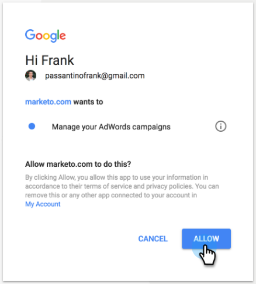

# Añadir Customer Match de Google como servicio de LaunchPoint {#add-google-customer-match-as-a-launchpoint-service}

Con esta integración, puede enviar una audiencia de Marketo a Google para que sea segmentada mediante Google AdWords, así como redirigir audiencias a través de YouTube, Search y Gmail.

>[!NOTE]
>
>**Se requieren permisos de administrador**

1. Vaya a **Administrador**.

   

1. Haga clic en **LaunchPoint**.

   

1. Select **Nuevo** then **Nuevo servicio**.

   

1. Escriba un **Nombre para mostrar** y seleccione **Coincidencia de clientes de Google** de la variable **Servicio** lista desplegable. Haga clic en **Crear**.

   

1. Para conectar una cuenta de Google AdWords, haga clic en **Autorizar**.

   

1. Google se abre en una pestaña nueva. Desde aquí, inicie sesión en su cuenta de Google AdWords.

   >[!CAUTION]
   >
   >Para que Marketo envíe audiencias en varias cuentas de AdWords, el usuario de Google que autorice en los pasos siguientes debe tener acceso a _all_ de estas cuentas.

   

1. Revise los permisos solicitados y haga clic en **Permitir**.

   

1. La cuenta de Google AdWords ahora está conectada a Marketo. Haga clic en **Crear**.

   

   ¡Increíble! Ahora verá Audiencias coincidentes de Google como un servicio de LaunchPoint en la pestaña Servicios instalados .

>[!NOTE]
>
>La integración de Google Customer Match solo puede admitir una cuenta de administrador y todas las subcuentas de dicha cuenta de administrador. No se admiten varias cuentas de administrador.
