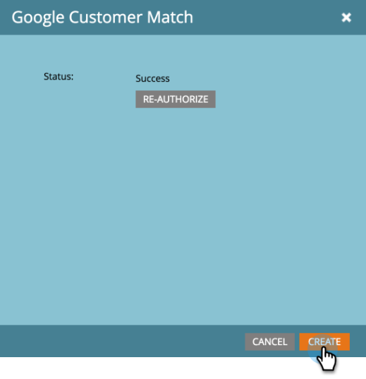

# Agregar la coincidencia de cliente de Google como servicio [!DNL LaunchPoint] {#add-google-customer-match-as-a-launchpoint-service}

Con esta integración, puede enviar una audiencia de Marketo a Google para que la use [!DNL Google AdWords], así como redirigir audiencias en YouTube, Search y [!DNL Gmail].

>[!NOTE]
>
>**Se requieren permisos de administración**

1. Ir a **[!UICONTROL Administrador]**.

   

1. Haga clic en **[!UICONTROL LaunchPoint]**.

   

1. Seleccione **[!UICONTROL Nuevo]** y después **[!UICONTROL Nuevo servicio]**.

   

1. Escriba un **[!UICONTROL Nombre para mostrar]** y seleccione **[!UICONTROL Coincidencia de clientes de Google]** en la lista desplegable **[!UICONTROL Servicio]**. Haga clic en **[!UICONTROL Crear]**.

   

1. Para conectar una cuenta de [!DNL Google AdWords], haga clic en **[!UICONTROL Autorizar]**.

   

1. Google se abre en una nueva pestaña. Desde aquí, inicie sesión en su cuenta de [!DNL Google AdWords].

   >[!CAUTION]
   >
   >Para que Marketo envíe audiencias a través de varias cuentas de [!DNL AdWords], el usuario de Google que usted haya autorizado en los siguientes pasos debe tener acceso a _todas_ estas cuentas.

   

1. Revise los permisos solicitados y luego haga clic en **[!UICONTROL Permitir]**.

   

1. Su cuenta de [!DNL Google AdWords] ahora está conectada a Marketo. Haga clic en **[!UICONTROL Crear]**.

   

   ¡Fantástico! Ahora verá Audiencias coincidentes de Google como un servicio [!DNL LaunchPoint] en la pestaña Servicios instalados.

>[!NOTE]
>
>La integración de Customer Match de Google solo puede admitir una cuenta de administrador y todas las subcuentas dentro de esa cuenta de administrador. No se admiten varias cuentas de administrador.
