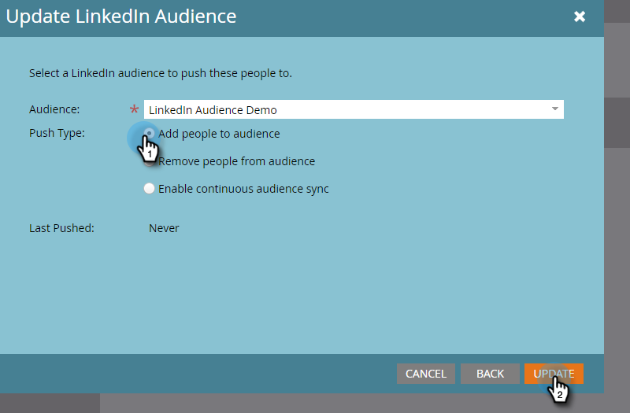

# Enviar una lista a una red de publicidad {#send-a-list-to-an-ad-network}

Aprenda a enviar una lista estática a LinkedIn, Facebook o Google.

## Cómo enviar una lista {#how-to-send-a-list}

1. En Marketo, seleccione la lista, haga clic en la lista desplegable **List Actions** y seleccione **Send to Ad Network**.

   

1. Elija entre LinkedIn, Facebook o Google (las demás opciones no están disponibles en este momento). En este ejemplo, elegimos **LinkedIn**. Haga clic en **Siguiente**.

   

1. Haga clic en la lista desplegable Audiencia y seleccione la audiencia que desee.

   

   >[!TIP]
   >
   >Si alguna vez necesita comprobarlo, puede ver la audiencia de destino a la que se está sincronizando una lista mediante la pestaña Estado .

1. Elija el tipo de push deseado y haga clic en **Actualizar**.

   

   >[!NOTE]
   >
   >Si selecciona &quot;Habilitar sincronización de audiencia continua&quot;, Marketo mantiene la lista actualizada en la red de publicidad elegida a medida que cambia la pertenencia a la lista en su instancia de Marketo.

1. ¡Y eso es todo! Haga clic en **OK** para salir.

   

## Preguntas frecuentes {#faq}

**¿Se puede sincronizar una sola lista estática con varias audiencias de publicidad?**

No, una lista solo se puede sincronizar con una sola audiencia de destino.

**Si habilito la sincronización continua con una audiencia de publicidad existente, ¿se reemplazará la audiencia existente?**

No, la audiencia existente se agregará a, no se reemplazará.
