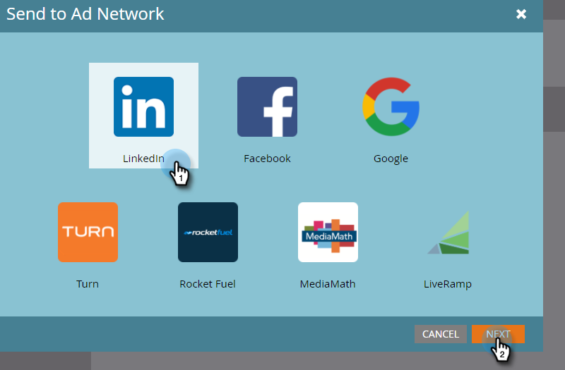
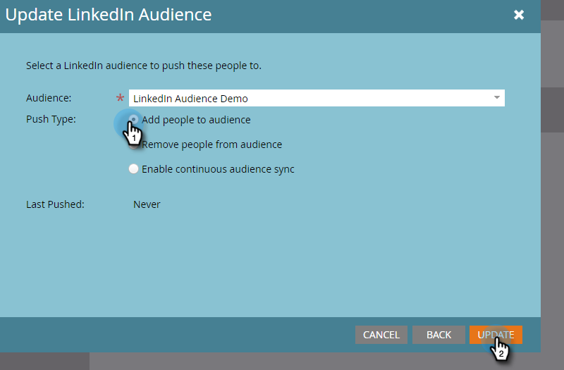

# Enviar una lista a una red de anuncios {#send-a-list-to-an-ad-network}

Obtenga información sobre cómo enviar una lista estática a [!DNL LinkedIn], [!DNL Facebook] o Google.

## Cómo enviar una lista {#how-to-send-a-list}

1. En Marketo, selecciona tu lista, haz clic en la lista desplegable **[!UICONTROL Acciones de lista]** y selecciona **[!UICONTROL Enviar a la red de publicidad]**.

   

1. Elija entre [!DNL LinkedIn], [!DNL Facebook] o Google (las demás opciones no están disponibles en este momento). En este ejemplo, elegimos **[!DNL LinkedIn]**. Haga clic en **[!UICONTROL Next]**.

   

1. Haga clic en el menú desplegable **[!UICONTROL Audiencia]** y seleccione la audiencia que desee.

   

   >[!TIP]
   >
   >Si alguna vez necesita comprobarlo, puede ver la audiencia de destino a la que se sincroniza una lista a través de la pestaña Estado.

1. Elija su [!UICONTROL tipo push] deseado y haga clic en **[!UICONTROL Actualizar]**.

   

   >[!NOTE]
   >
   >Si selecciona &quot;[!UICONTROL Habilitar la sincronización continua de audiencias]&quot;, Marketo mantiene la lista actualizada en la red de anuncios elegida a medida que cambia la lista en la instancia de Marketo. Agregamos **y** quitamos personas de la audiencia si se agregan o eliminan de la lista estática.

1. Haga clic en **[!UICONTROL Aceptar]** para salir.

   

## Preguntas frecuentes {#faq}

**¿Se puede sincronizar una sola lista estática con varias audiencias de publicidad?**

No, una lista solo se puede sincronizar con una sola audiencia de destino.

**Si habilito la sincronización continua con una audiencia de publicidad existente, ¿se reemplazará la audiencia existente?**

No, la audiencia existente se agregará a, no se reemplazará.
