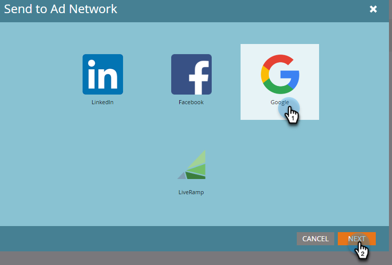

# Enviar una lista a Google {#send-a-list-to-google}

Para aquellos que utilizan Customer Match de Google, siga los pasos a continuación para enviar una lista estática de Marketo Engage a su cuenta de Google.

1. En Marketo Engage, busque y seleccione la lista que desee.

   

1. Haga clic en **Enumerar acciones** y seleccione. **Enviar a la red de publicidad**.

   

1. Seleccione Google y haga clic en **Siguiente**.

   

1. Elija la cuenta publicitaria que desee. Puede elegir una audiencia existente o crear una nueva. En este ejemplo, estamos creando uno nuevo. Asigne un nombre a la nueva audiencia.

   

1. Realice las selecciones opcionales.

   

   >[!NOTE]
   >
   >* Seleccionar **Mantener sincronización del abono a audiencia** mantiene la lista actualizada a medida que cambia en la instancia. Añadimos o eliminamos personas de la audiencia cuando se añaden o eliminan de la lista estática.
   >
   >* Al seleccionar la casilla de verificación en la parte inferior, se envía el estado de consentimiento como CONCEDIDO para los datos de usuario enviados a Google Ads con fines de publicidad y personalización de anuncios. Si lo deja sin marcar, el estado de consentimiento se envía como NO ESPECIFICADO. Para aquellos que planean cargar datos para usuarios en el Espacio Económico Europeo (EEE), Google ha elaborado una lista de [Preguntas frecuentes](https://support.google.com/google-ads/answer/14310715){target="_blank"}, as well as additional details outlining the [EU user consent policy](https://www.google.com/about/company/user-consent-policy/){target="_blank"}.

1. Clic **Actualizar**.

   

1. Clic **OK** para salir.

   
