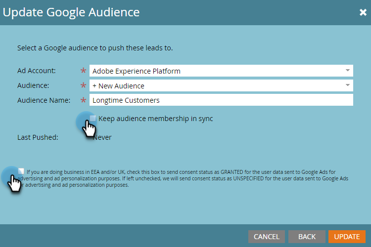

# Enviar una lista a Google {#send-a-list-to-google}

Para aquellos que utilizan Customer Match de Google, siga los pasos a continuación para enviar una lista estática de Marketo Engage a su cuenta de Google.

1. En Marketo Engage, busque y seleccione la lista que desee.

   

1. Haga clic en la lista desplegable **Acciones de lista** y seleccione **Enviar a la red de publicidad**.

   

1. Elija Google y haga clic en **Siguiente**.

   

1. Elija la cuenta publicitaria que desee. Puede elegir una audiencia existente o crear una nueva. En este ejemplo, estamos creando uno nuevo. Asigne un nombre a la nueva audiencia.

   

1. Realice las selecciones opcionales.

   

   >[!NOTE]
   >
   >* Al seleccionar **Mantener la pertenencia a la audiencia sincronizada**, la lista se mantiene actualizada a medida que cambia en la instancia. La pertenencia a audiencias se actualiza cuando se agregan o eliminan personas de la lista estática.
   >
   >* Al seleccionar la casilla de verificación en la parte inferior, se envía el estado de consentimiento como CONCEDIDO para los datos de usuario enviados a Google Ads con fines de publicidad y personalización de anuncios. Si lo deja sin marcar, el estado de consentimiento se envía como NO ESPECIFICADO. Para aquellos que planean cargar datos para usuarios en el Espacio Económico Europeo (EEE), Google ha reunido una lista de [preguntas frecuentes](https://support.google.com/google-ads/answer/14310715){target="_blank"}, así como detalles adicionales que describen la [política de consentimiento del usuario de la UE](https://www.google.com/about/company/user-consent-policy/){target="_blank"}.

1. Haga clic en **Actualizar**.

   

1. Haga clic en **Aceptar** para salir.

   
