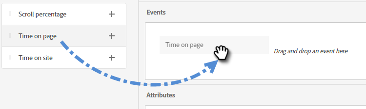
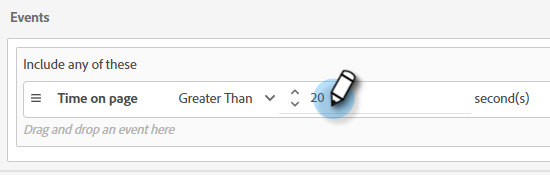
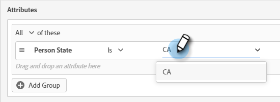
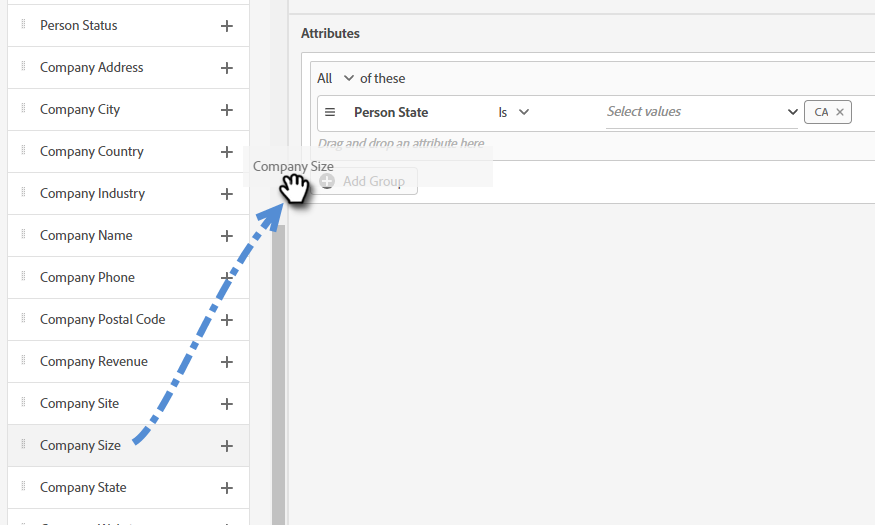
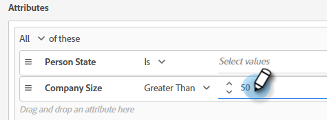

# Criterios de audiencia {#audience-criteria}

Al igual que las listas inteligentes de Marketo Engage, los atributos de Criterios de audiencia permiten definir la audiencia de destino. Puede dirigirse a personas conocidas o desconocidas mediante atributos deducidos, persona o compañía (o una combinación de ellos).

## Prioridad {#priority}

La prioridad determina qué diálogo recibe un posible cliente en caso de que cumpla los requisitos para más de uno. Se establece cuando usted primero [cree su cuadro de diálogo](/help/marketo/product-docs/demand-generation/dynamic-chat-two/automated-chat/create-a-dialogue.md){target="_blank"}. Para cambiar la prioridad de un cuadro de diálogo existente, ábralo y vaya a **Detalles del diálogo** en la pestaña Criterios de audiencia.

## Eventos {#events}

Los eventos le permiten segmentar visitantes en función de su desplazamiento o del tiempo que lleven en la página o sitio. En el ejemplo siguiente, se segmenta a los visitantes que han estado en una página específica durante más de 20 segundos.

1. Coja el **Tiempo en la página** y arrástrelo a la derecha.

   

1. Establezca el tiempo &quot;Mayor que&quot; en 20 segundos.

   

1. Añada la dirección URL de la página deseada en [Target](#target) sección.

   

## Atributos {#attributes}

**Personas conocidas**

No hay _muchos_ combinaciones de atributos para elegir. En el ejemplo siguiente, se hace referencia a todas las **personas conocidas** en California que trabajan en una empresa con más de 50 empleados.

1. Coja el **Estado de persona** y arrástrelo a la derecha.

   

1. _Es_ está configurado de forma predeterminada. En el campo Seleccionar valores, escriba CA (también puede hacer clic en la lista desplegable y seleccionar en la lista).

   

1. Coja el **Tamaño de empresa** y arrástrelo a donde dice _arrastre y suelte un atributo aquí_.

   

   >[!NOTE]
   >
   >También puede elegir un atributo haciendo clic en su **+** icono.

1. Haga clic en la lista desplegable del operador y seleccione **Mayor que**.

   

1. Escriba 50 y haga clic en cualquier otra parte de la pantalla para guardar.

   

¡Y eso es todo!

**Personas anónimas**

Hay una manera fácil de dirigirse específicamente a personas que aún no están en la base de datos. En este ejemplo, estamos segmentando todos **personas anónimas** situado en el área de Nueva York.

1. Coja el **Correo electrónico de persona** y arrástrelo a la derecha.

   

1. Haga clic en la lista desplegable del operador y seleccione **Is Empty**.

   

1. Coja el **Estado deducido** y arrástrelo a donde dice _arrastre y suelte un atributo aquí_.

   

   >[!NOTE]
   >
   >Cuando alguien visita su sitio web, [Munchkin](/help/marketo/product-docs/administration/additional-integrations/add-munchkin-tracking-code-to-your-website.md){target="_blank"} las cookies y las introduce en el sistema. Buscamos su IP en una base de datos especial e inferimos todo tipo de buena información.

1. _Es_ está configurado de forma predeterminada. En el campo Seleccionar valores, escriba NY (también puede hacer clic en la lista desplegable y seleccionar en la lista).

   

## Abono {#membership}

Utilice listas inteligentes de Marketo Engage para la audiencia de destino del cuadro de diálogo.

1. Bajo Membresía, agarrar **Miembro de lista inteligente** y suéltelo en el lienzo.

   

1. Seleccione la lista inteligente que desee.

   

## Agregar grupos {#add-groups}

También tiene la opción de agrupar atributos, en caso de que desee tener todos ciertos atributos junto con &quot;todos o cualquiera&quot; de otro. Puede agregar varios grupos.

## Destino {#target}

Aquí es donde se introducen las direcciones URL en las que se desea mostrar un cuadro de diálogo específico. También tiene la opción de añadir exclusiones.

Formatos admitidos:

* `http://website.com`
* `https://*.website.com`
* `http://website.com/folder/*`
* `https://*.website.com/folder/*`

>[!NOTE]
>
>El uso de un asterisco actúa como comodín global. Entonces `https://*.website.com` colocaría el cuadro de diálogo en cada página del sitio, incluidos los subdominios (por ejemplo: `support.website.com`). Y `https://website.com/folder/*` colocaría el cuadro de diálogo en cada página del HTML en la carpeta siguiente (por ejemplo: en este caso supongamos que la carpeta es &quot;sports&quot;, por lo que: website.com/sports/baseball.html, website.com/sports/football.html, etc.).

**Exclusiones**

Utilice exclusiones para asegurarse de que el cuadro de diálogo sí **no** aparecen en una página o área específica del sitio. Las exclusiones siguen el mismo formato que las inclusiones.

>[!MORELIKETHIS]
>
>* [Crear un cuadro de diálogo](/help/marketo/product-docs/demand-generation/dynamic-chat-two/automated-chat/create-a-dialogue.md){target="_blank"}
>* [Diseñador de flujo](/help/marketo/product-docs/demand-generation/dynamic-chat-two/automated-chat/stream-designer.md){target="_blank"}
