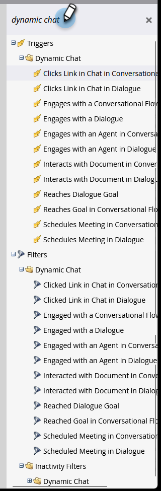

# Actividades del Dynamic Chat {#dynamic-chat-activities}

Dynamic Chat ofrece varios filtros y déclencheur para utilizarlos en sus listas inteligentes.

## Cosas que hay que tener en cuenta {#things-to-note}

* Las condiciones son compatibles con los pasos de flujo del Dynamic Chat
* Las actividades del Dynamic Chat se pueden sincronizar con [Perspectiva de ventas de Marketo](/help/marketo/product-docs/marketo-sales-insight/msi-for-salesforce/features/dynamic-chat-integration.md){target="_blank"}
* Puede ver actividades de Dynamic Chat individuales en el registro de actividad de una persona
