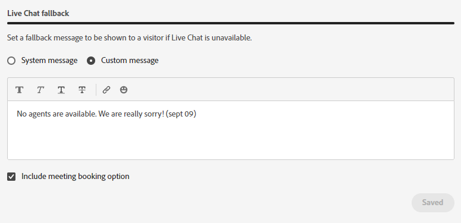

# Administración de agentes {#agent-management}

En la administración de agentes, consulte la lista de agentes de la instancia de Dynamic Chat, administre los equipos y establezca las reglas de reserva.

## Agentes {#agents}

Esta pestaña lista todos los agentes de su instancia de Dynamic Chat e incluye información como su nombre, dirección de correo electrónico, estado de Live Chat y más.

PICC2 - NECESITA CAPTURA DE PANTALLA DE CHICOS

## Equipos {#teams}

Los administradores pueden crear equipos de agentes para facilitar el envío a grupos específicos de agentes de ventas.

### Crear un equipo {#create-a-team}

1. Clic **+ Crear equipo**.

   

1. Dé un nombre a su equipo.

   

1. Haga clic en **Agregar agentes** y seleccione los agentes que desee.

   

1. Haga clic en **Crear**.

   

## Reglas de reserva {#fallback-rules}

### Reunión alternativa {#meeting-fallback}

Seleccione un mensaje estándar (del sistema) o escriba uno personalizado para que los visitantes vean cuándo no está disponible la reserva de la reunión.

### Live Chat Fallback {#live-chat-fallback}

Seleccione un mensaje estándar (del sistema) o escriba uno personalizado para que los visitantes vean cuándo Live Chat no está disponible.

>[!TIP]
>
>Al crear un mensaje personalizado, puede aplicar estilo a la fuente, utilizar vínculos e incluso insertar emojis. `:)`
