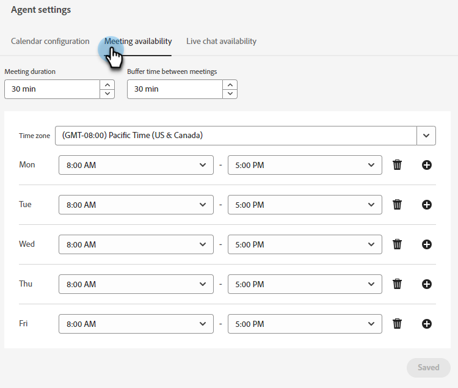

# Configuración del agente {#agent-settings}

Configure su calendario y establezca la disponibilidad de la reunión/chat en vivo.

## Conectar calendario {#connect-calendar}

En la pestaña de configuración del Calendario, conecte el calendario de Outlook o Gmail para utilizarlo en la programación de citas en el bot de chat.

Una vez que el calendario de un usuario está conectado al Dynamic Chat, se agregará a la cola y estará disponible para que los visitantes del sitio web programen citas en.

>[!NOTE]
>
>Puede conectar un calendario por usuario. Si desea recibir reuniones en varios calendarios, debe agregar varios usuarios y hacer que cada uno conecte sus calendarios.

Los usuarios también pueden personalizar el cuerpo de la invitación que se envía al visitante cuando este programa una cita en el calendario del usuario. También pueden seleccionar la casilla de verificación de la parte inferior para incluir un vínculo de Google Meet o Microsoft Teams (según el calendario conectado).

>[!TIP]
>
>Utilice el icono de token (llaves) para personalizar los correos electrónicos de confirmación de reserva de la reunión con atributos de persona o compañía.

### Permisos {#permissions}

La configuración con Outlook concede los siguientes permisos al Dynamic Chat:

* Acceso completo a sus calendarios
* Inicie sesión y lea su perfil
* Mantener el acceso a los datos a los que le ha dado acceso
* Leer la configuración del buzón

La configuración con Google concede los siguientes permisos a Dynamic Chat:

* Crear, cambiar o eliminar calendarios
* Actualización de eventos de calendario individuales
* Cambiar la configuración, incluso quién puede ver los eventos
* Cambiar con quién se comparte el calendario
* Acceso a su nombre, dirección de correo electrónico, preferencia de idioma e imagen de perfil

## Disponibilidad de reserva de reunión {#meeting-booking-availability}

Establezca su zona horaria y la disponibilidad de hora/día de la semana para recibir las reservas de la reunión.

<table> 
 <tbody> 
  <tr> 
   <td><b>Duración de la reunión</b></td>
   <td>Longitud máxima de la reunión. - ¿QUÉ PASA? ¿FINALIZACIÓN AUTOMÁTICA?</td>
  </tr> 
  <tr> 
   <td><b>Tiempo de espera entre reuniones</b></td>
   <td>Cantidad de tiempo que se establece como búfer para después de la reunión. Si lo establece para 30 minutos, nadie podrá reservar una reunión con usted hasta 31 minutos después del final programado de una reunión en su calendario. - 31 o 30???????????</td>
  </tr>
 </tbody> 
</table>

>[!TIP]
>
>Puede seleccionar varios bloques de tiempo en el mismo día (por ejemplo, viernes de 8 a 12 p. m. _y_ 1p-5p) haciendo clic en **+** Firme a la derecha.

## Disponibilidad de chat en vivo {#live-chat-availability}

Establece tu zona horaria y disponibilidad de hora/día de la semana para recibir chats en vivo.

Si ha iniciado sesión en la aplicación, recibirá una notificación dentro de la aplicación de un chat entrante. Si no ha iniciado sesión, recibirá una notificación del explorador (en Google Chrome).

>[!IMPORTANT]
>
>El [alternancia de disponibilidad](/help/marketo/product-docs/demand-generation/dynamic-chat-two/live-chat/agent-inbox.md#availability-toggle){target="_blank"} en la bandeja de entrada del agente **anulará** lo que introduce en la pestaña Disponibilidad de Live Chat. Por lo tanto, si está programado como disponible de 1p a 5p pero necesita tomarse un descanso rápido a 3p, no necesita alterar la configuración de su agente. El estado de la opción de disponibilidad permanecerá hasta que la cambie manualmente o hasta que llegue el siguiente bloque de tiempo de disponibilidad.

>[!TIP]
>
>Puede seleccionar varios bloques de tiempo en el mismo día (por ejemplo, viernes de 8 a 12 p. m. _y_ 1p-5p) haciendo clic en **+** Firme a la derecha.
