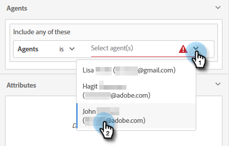

# Enrutando {#routing}

Las reuniones reservadas en Dynamic Chat se pueden organizar de dos maneras. Operación por turnos o uso de una regla personalizada.

Operación por turnos: las reuniones se asignan a los agentes de forma secuencial. Así que si tienes cinco agentes y el agente tres tomó la última reunión, el agente cuatro tendrá la siguiente, seguido por el agente cinco, y luego volverá al agente uno.

Regla personalizada: puede elegir agentes específicos para recibir reuniones en función de los atributos que seleccione.

## Crear una regla personalizada {#create-a-custom-rule}

En este ejemplo, se envían todas las reuniones de los estados deducidos de CA, OR y WA al agente John.

1. En Configuración, haga clic en **Reglas de enrutamiento**.

   

1. Haga clic en **Reglas personalizadas** pestaña.

   

1. Clic **Crear regla**.

   

1. Asigne un nombre a la regla Si lo desea, puede agregar una descripción y establecer su nivel de prioridad. Clic **Siguiente**.

   

1. Elija los agentes que desee.

   

1. Arrastre sobre los atributos que desee.

   

1. Busque y seleccione los valores que desee.

   

1. Cuando haya seleccionado todos los valores deseados, haga clic en **Guardar**.

   

## Enrutamiento de cuenta {#account-routing}

Identifique y cargue su cuenta de Target y sus respectivos propietarios de ventas, y enrute a los visitantes que provengan de esas cuentas directamente al propietario de la cuenta correspondiente.

Enrutamiento del equipo - DELETE ESTAS REFERENCIAS POR AHORA

Miembro de enrutamiento de listas inteligentes: POSIBLEMENTE RETRASADO
