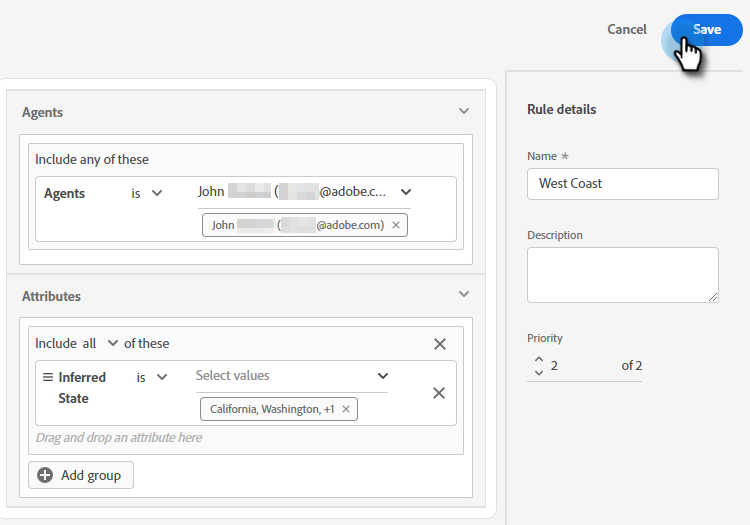

# Enrutando {#routing}

Las reuniones reservadas en Dynamic Chat pueden ser enrutadas de dos maneras. Redondeo o uso de una regla personalizada.

Redondeo: Las reuniones se asignan a los agentes secuencialmente. Así que si tiene cinco agentes y el agente tres tomó la última reunión, el agente cuatro tendrá la siguiente, seguido del agente cinco, luego volverá al agente uno.

Regla personalizada: Puede elegir agentes específicos para recibir reuniones en función de los atributos que seleccione.

## Crear una regla personalizada {#create-a-custom-rule}

En este ejemplo estamos enviando todas las reuniones de los estados inferidos de CA, OR y WA al agente John.

1. En Dynamic Chat, seleccione **Enrutamiento**.

   

1. Haga clic en el **Reglas personalizadas** pestaña .

   

1. Haga clic en **Crear regla**.

   

1. Asigne un nombre a la regla y haga clic en **Siguiente**.

   

1. Elija los agentes que desee.

   

1. Arrastre los atributos que desee.

   

1. Busque y seleccione los valores que desee.

   

1. Cuando se seleccionen todos los valores deseados, haga clic en **Guardar**.

   
