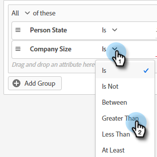
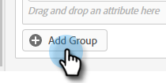

# Criterios de audiencia {#audience-criteria}

Al igual que las listas inteligentes de Marketo Engage, los atributos de Criterios de audiencia permiten definir la audiencia de destino. Puede dirigirse a personas conocidas o desconocidas mediante atributos deducidos, persona o compañía (o una combinación de ellos).

## Prioridad {#priority}

La prioridad determina qué diálogo recibe un posible cliente en caso de que cumpla los requisitos para más de uno. Se establece la primera vez que [crea el Diálogo](/help/marketo/product-docs/demand-generation/dynamic-chat/automated-chat/create-a-dialogue.md){target="_blank"}. Para cambiar la prioridad de un cuadro de diálogo existente, ábralo y vaya a **[!UICONTROL Detalles del cuadro de diálogo]** en la pestaña Criterios de audiencia.

## Eventos {#events}

Los eventos le permiten segmentar visitantes en función de su desplazamiento o del tiempo que lleven en la página o sitio. En el ejemplo siguiente, se segmenta a los visitantes que han estado en una página específica durante más de 20 segundos.

1. Coja el evento **[!UICONTROL Time on Page]** y arrástrelo a la derecha.

   

1. Establezca el tiempo &quot;[!UICONTROL Mayor que]&quot; en 20 segundos.

   

1. Agregue la dirección URL de la página deseada en la sección [[!UICONTROL Target]](#target).

   

## Atributos {#attributes}

**Personas conocidas**

Hay _muchas_ combinaciones de atributos para elegir. En el siguiente ejemplo, nos dirigimos a todas las personas conocidas en California que trabajan en una empresa con más de 50 empleados.

1. Coja el atributo **[!UICONTROL Estado de la persona]** y arrástrelo hacia la derecha.

   

1. _[!UICONTROL Is]_ está establecido de manera predeterminada. En el campo Seleccionar valores, escriba CA (también puede hacer clic en la lista desplegable y seleccionar en la lista).

   

1. Coja el atributo **[!UICONTROL Tamaño de la compañía]** y arrástrelo hasta donde dice _arrastre y suelte un atributo aquí_.

   

   >[!NOTE]
   >
   >También puede elegir un atributo haciendo clic en su icono **+**.

1. Haga clic en el menú desplegable del operador y seleccione **[!UICONTROL Mayor que]**.

   

1. Escriba 50 y haga clic en cualquier otra parte de la pantalla para guardar.

   

¡Y eso es todo!

**Personas anónimas**

Hay una manera fácil de dirigirse específicamente a personas que aún no están en la base de datos. En este ejemplo, estamos dirigiéndonos a todas las personas anónimas ubicadas en el área de Nueva York.

1. Coja el atributo **[!UICONTROL Correo electrónico de persona]** y arrástrelo a la derecha.

   

1. Haga clic en el desplegable del operador y seleccione **[!UICONTROL Está vacío]**.

   

1. Coja el atributo **[!UICONTROL Estado deducido]** y arrástrelo hasta donde dice _arrastre y suelte un atributo aquí_.

   

   >[!NOTE]
   >
   >Cuando alguien visita tu sitio web, [Munchkin](/help/marketo/product-docs/administration/additional-integrations/add-munchkin-tracking-code-to-your-website.md){target="_blank"} los cookies y los coloca en el sistema. Buscamos su IP en una base de datos especial e inferimos todo tipo de buena información.

1. _[!UICONTROL Is]_ está establecido de manera predeterminada. En el campo Seleccionar valores, escriba NY (también puede hacer clic en la lista desplegable y seleccionar en la lista).

   

## Membresía {#membership}

Utilice las listas inteligentes de Marketo Engage para la audiencia de destino del cuadro de diálogo.

>[!AVAILABILITY]
>
>El miembro de los criterios Smart List o Member of List requiere Dynamic Chat Prime. Póngase en contacto con el equipo de cuenta de Adobe (su administrador de cuentas) para obtener más información.

1. En Suscripción, coja **[!UICONTROL Miembro de la lista inteligente]** y suéltelo en el lienzo.

   

1. Seleccione la lista inteligente que desee.

   

## Agregar grupos {#add-groups}

También tiene la opción de agrupar atributos, en caso de que desee tener todos ciertos atributos junto con &quot;todos o cualquiera&quot; de otro. Puede agregar varios grupos.

## Objetivo {#target}

Aquí es donde se introducen las direcciones URL en las que se desea mostrar un cuadro de diálogo específico. También tiene la opción de añadir exclusiones.

Formatos admitidos:

* `http://website.com`
* `https://*.website.com`
* `http://website.com/folder/*`
* `https://*.website.com/folder/*`

>[!NOTE]
>
>* El uso de un asterisco actúa como comodín global. Así que `https://*.website.com` colocaría el cuadro de diálogo en todas las páginas del sitio, incluidos los subdominios (por ejemplo: `support.website.com`). Y `https://website.com/folder/*` colocaría el cuadro de diálogo en cada página de HTML en la carpeta siguiente (por ejemplo: en este caso supongamos que la carpeta es &quot;sport&quot;, por ejemplo: website.com/sports/baseball.html, website.com/sports/football.html, etc.).
>
>* Los parámetros de URL no son compatibles en este momento.

**Exclusiones**

Use exclusiones para asegurarse de que el cuadro de diálogo _no_ aparezca en una página o área específica del sitio. Las exclusiones siguen el mismo formato que las inclusiones.

>[!MORELIKETHIS]
>
>* [Crear un cuadro de diálogo](/help/marketo/product-docs/demand-generation/dynamic-chat/automated-chat/create-a-dialogue.md){target="_blank"}
>* [Transmitir Designer](/help/marketo/product-docs/demand-generation/dynamic-chat/automated-chat/stream-designer.md){target="_blank"}
