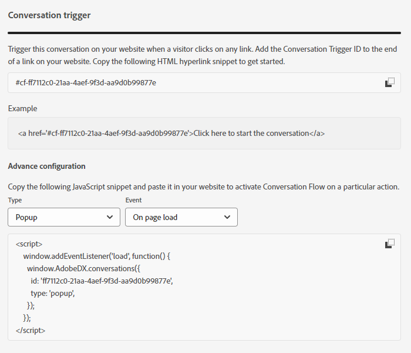

# Resumen de flujo de conversación {#conversational-flow-overview}

Déclencheur Diseñe un flujo de conversación y envíeselo a cualquier visitante en función de una acción específica (por ejemplo, hacer clic en un botón de llamada a la acción, al cargar la página, el tiempo invertido en la página, etc.).

## Diálogos frente a flujos de conversación {#dialogues-vs-conversational-flows}

Aunque los cuadros de diálogo y los flujos de conversación tienen varias similitudes, son dos características independientes.

<table> 
 <tbody> 
  <tr> 
   <th style="width:50%">Diálogos</th> 
   <th style="width:50%">Flujos de conversación</th>
  </tr> 
  <tr> 
   <td>Los cuadros de diálogo son objetivos: se diseña una conversación para una página y una audiencia específicas en función de los parámetros implementados.</td> 
   <td>Los flujos de conversación se activan: diseña una conversación que se puede activar en función de la acción de un visitante, como rellenar un formulario, hacer clic en un vínculo, etc.</td>
  </tr>
   <tr> 
   <td>Solo se admite en la interfaz del bot de chat.</td> 
   <td>Actualmente se admite en una interfaz emergente, con más interfaces planificadas.</td>
  </tr>
  </tr>
   <tr> 
   <td>Se pueden crear varios cuadros de diálogo para el mismo segmento de posibles clientes, con un orden de prioridad para que cada visitante vea el cuadro de diálogo en secuencia según la prioridad a medida que continúa interactuando.</td> 
   <td>Los flujos de conversación no tienen orden de prioridad y el mismo posible cliente puede activarlos cualquier cantidad de veces en función de la llamada a acción determinada.</td>
  </tr>
  <tr>
   <td>Las conversaciones con los bots de chat utilizan los cuadros de diálogo.</td>
   <td><a href="/help/marketo/product-docs/demand-generation/dynamic-chat/automated-chat/conversational-flow-settings-for-marketo-engage-forms.md" target="_blank">Conversational Forms</a> en Marketo Engage utilizan Flujos de conversación.</td>
  </tr>
 </tbody> 
</table>

## Pestaña Diseñador de secuencias {#stream-designer-tab}

El Diseñador de secuencias para flujos de conversación es casi idéntico al de los cuadros de diálogo. [Obtenga más información aquí](/help/marketo/product-docs/demand-generation/dynamic-chat/automated-chat/stream-designer.md){target="_blank"}.

## Pestaña Informes {#reports-tab}

La pestaña Informes es donde podrá ver las métricas sobre el rendimiento de su flujo de conversación.

Vea la tasa de participación, la tasa de conversión, filtre por visitantes conocidos o desconocidos, etc.

## Pestaña Configuración {#settings-tab}

En la mitad superior de la pestaña Configuración, puede actualizar el nombre del flujo de conversación, agregar una descripción opcional y cambiar el idioma.

>[!NOTE]
>
>Al seleccionar un idioma diferente, solo cambia el idioma del texto del sistema. Usted es responsable de traducir contenido.

### SDK de conversaciones {#conversations-sdk}

En la mitad inferior de la pestaña Configuración, personalice el déclencheur de conversación, también conocido como SDK de conversaciones. Puede decidir si la conversación se activa en el sitio web cuando un visitante hace clic en un vínculo o al cargar la página.

>[!TIP]
>
>Consulte [SDK de conversaciones](https://experienceleague.adobe.com/tools/marketo-dynamic-chatbot/conversations-sdk/){target="_blank"} ¡en acción!

>[!MORELIKETHIS]
>
>[Crear un flujo de conversación](/help/marketo/product-docs/demand-generation/dynamic-chat/automated-chat/create-a-conversational-flow.md){target="_blank"}
