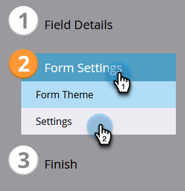
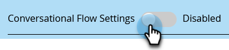
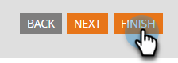

# Configuración Del Flujo De Conversación Para Marketo Engage Forms{#conversational-flow-settings-for-marketo-engage-forms}

Haga que Marketo Engage Forms sea conversacional al integrarlo con Flujos de conversación de Dynamic Chat. Califique instantáneamente clientes potenciales mediante los datos de formulario o la suscripción a listas inteligentes para reuniones, reservas de reuniones, vínculos a documentos técnicos o objetivos personalizados.

>[!AVAILABILITY]
>
>El miembro de los criterios Smart List o Member of List requiere Dynamic Chat Prime. Póngase en contacto con el equipo de cuenta de Adobe (su administrador de cuentas) para obtener más información.

1. Busque y seleccione el formulario (o cree uno nuevo).

   

1. Haga clic en **[!UICONTROL Editar borrador]**.

   

1. En la página de edición del formulario, haga clic en **[!UICONTROL Configuración del formulario]** y, a continuación, en **[!UICONTROL Configuración]**.

   

1. Haga clic en el control deslizante **[!UICONTROL Configuración del flujo de conversación]** para habilitar.

   

1. Aparecerá un modal Opción predeterminada. Seleccione su preferencia. En este ejemplo elegimos **[!UICONTROL Usar flujo de conversación]**.

   

1. Seleccione el **[!UICONTROL flujo de conversación]** y el **[!UICONTROL tipo de entrega]** deseados.

   

   >[!NOTE]
   >
   >[Más información sobre los Flujos de conversación](/help/marketo/product-docs/demand-generation/dynamic-chat/automated-chat/conversational-flow-overview.md){target="_blank"}

   **PASO OPCIONAL**: puede hacer clic en **[!UICONTROL Agregar opción]** para dirigirse a los visitantes de chat que cumplan un criterio específico. Puede añadir hasta nueve opciones para un total de diez.

   

   >[!NOTE]
   >
   >El explorador del visitante debe tener la cookie de ser una persona conocida antes del envío del formulario para poder pertenecer a la lista estática/inteligente.

   **PASO OPCIONAL**: haga clic en el signo **+** dentro de cada paso para agregar más atributos, lo que le permite reducir la audiencia de destino (los atributos disponibles son los campos que ha elegido para el formulario). En este ejemplo, nos dirigimos a Adobe Technical Writers de California.

   

   >[!NOTE]
   >
   >La lógica de criterios establecida en &quot;todo&quot; significa que todos los atributos deben cumplirse para poder calificarse. La lógica de criterios establecida en &quot;cualquiera&quot; significa que cualquiera de los atributos será suficiente.

   **PASO OPCIONAL**: si agrega dos o más opciones, puede reordenarlas haciendo clic en sus flechas arriba/abajo.

   

1. Haga clic en **[!UICONTROL Finalizar]** cuando haya terminado.

   
