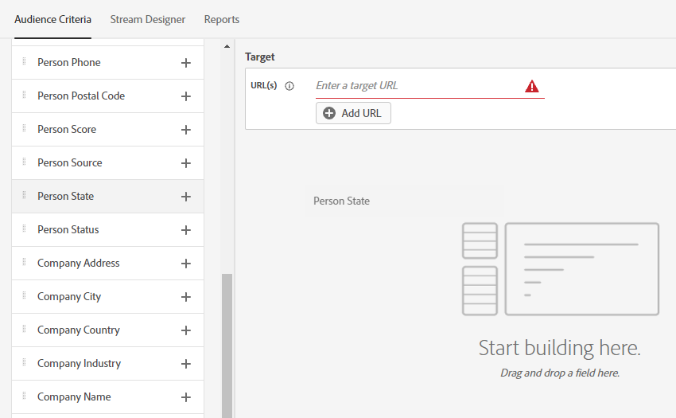
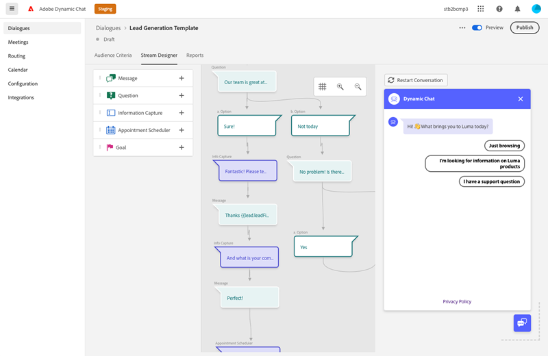
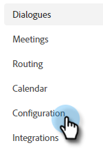
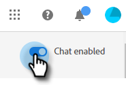

# Información general del diálogo {#dialogue-overview}

Los cuadros de diálogo son conversaciones de chat individuales. En cada Diálogo, usted decide dónde se muestra la conversación de chat específica, a quién se mostrará y cuál será el contenido de la conversación. Cada cuadro de diálogo también tiene su propia página de informe, donde puede supervisar la eficacia.

## Criterios de audiencia {#audience-criteria}

La sección [Criterios de audiencia](/help/marketo/product-docs/demand-generation/dynamic-chat/automated-chat/audience-criteria.md){target="_blank"} de un cuadro de diálogo es donde definirá dónde y a quién se mostrará su conversación de chat

## Diseñador de flujo {#stream-designer}

La sección [Stream Designer](/help/marketo/product-docs/demand-generation/dynamic-chat/automated-chat/stream-designer.md){target="_blank"} de un Diálogo es donde diseñarás la conversación que deseas tener con los visitantes de tu sitio web.

## Informes {#reports}

En la pestaña Informes podrá ver las métricas relacionadas con el rendimiento del cuadro de diálogo.

<table>
 <tr>
  <td><strong>Total activados</strong></td>
  <td>Aumenta cada vez que un visitante cumple los requisitos o se muestra un cuadro de diálogo.
</td>
 </tr>
 <tr>
  <td><strong>Comprometido</strong></td>
  <td>Aumenta cuando un visitante interactúa con al menos una tarjeta en un cuadro de diálogo (por ejemplo, Pregunta, Captura de información, etc.)</td>
 </tr>
 <tr>
  <td><strong>Completado</strong></td>
  <td>Aumenta cada vez que un visitante llega al final de una rama en un Diálogo.</td>
 </tr>
 <tr>
  <td><strong>Persona adquirida</strong></td>
  <td>Aumenta cada vez que un visitante proporciona una dirección de correo electrónico válida en un flujo de diálogo.</td>
 </tr>
 <tr>
  <td><strong>Reuniones planificadas</strong></td>
  <td>Aumenta cada vez que un visitante programa correctamente una cita a través del bot de chat.</td>
 </tr>
 <tr>
  <td><strong>Metas alcanzadas</strong></td>
  <td>Aumenta cada vez que un visitante alcanza un objetivo en cualquier flujo de diálogo.</td>
 </tr>
</table>

## Desactivar/activar todos los cuadros de diálogo {#disable-enable-all-dialogues}

Puede desactivar (y volver a activar) todos los cuadros de diálogo publicados al mismo tiempo.

1. En Dynamic Chat, haga clic en la ficha **[!UICONTROL Configuración]**.

   

1. Cambie el conmutador **[!UICONTROL Chat habilitado]** a Desactivado para deshabilitar (y vuelva a activarlo para volver a habilitar) todos los cuadros de diálogo.

   
