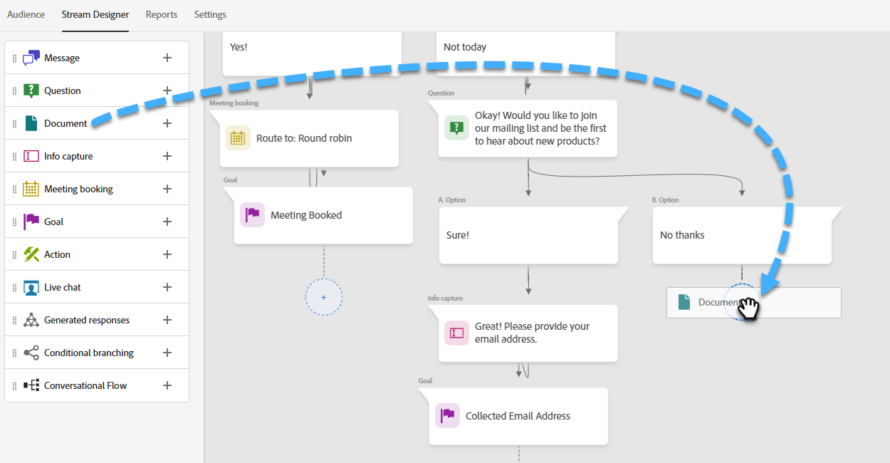

# Diseñador de flujo {#stream-designer}

No hay _muchos_ combinaciones de flujo posibles. Este artículo contiene un ejemplo en el que el experto en marketing pregunta al visitante del sitio si tiene alguna pregunta sobre el producto. Si es así, el visitante puede programar una cita. Si no es así, el visitante tiene la opción de unirse a una lista de correo para correspondencia futura. También se les ofrece un PDF gratis. El objetivo final es programar una cita o recopilar el correo electrónico del visitante.

>[!PREREQUISITES]
>
>Para poder usar la tarjeta de documento, primero debe [configúrelo.](/help/marketo/product-docs/demand-generation/dynamic-chat/integrations/adobe-pdf-embed-api.md){target="_blank"} en su cuenta de Adobe.

## Tarjetas de diseñador de Stream {#stream-designer-cards}

El diseñador de secuencias contiene varias tarjetas que puede agregar para dar forma a la conversación de chat.

<table>
 <tr>
  <td style="width:25%"><strong>Mensaje</strong></td>
  <td>Utilícelo cuando desee realizar una declaración sin necesidad de respuesta (por ejemplo: "¡Hola! Todos los artículos tienen un 25% de descuento hoy con el código SAVE25").
</td>
 </tr>
 <tr>
  <td style="width:25%"><strong>Pregunta</strong></td>
  <td>Úselo cuando quiera hacer una pregunta de opción múltiple, de la que proporcione las respuestas disponibles (por ejemplo: ¿Qué tipo de vehículo le interesa? Respuestas = SUV, Compact, Truck, etc.).</td>
 </tr>
 <tr>
  <td style="width:25%"><strong>Documento</strong></td>
  <td>Permite incrustar documentos del PDF en los cuadros de diálogo y realizar un seguimiento de la actividad de participación de los visitantes en los documentos (cuántas páginas se vieron, si se descargó el documento o los términos de búsqueda utilizados).</td>
 </tr>
 <tr>
  <td style="width:25%"><strong>Captura de información</strong></td>
  <td>Utilícelo cuando desee recopilar información (por ejemplo, nombre, dirección de correo electrónico, cargo, etc.). Después de elegir a qué campo atribuir su respuesta, puede elegir entre dejar que el visitante escriba su respuesta o seleccionar opciones de una lista de selección que determine (sugerencia: esta última puede ayudar con la limpieza de la base de datos). También puede sobrescribir con su respuesta los datos que tenga actualmente enumerados para ellos, o bien, omitir la pregunta por completo si ya tiene un valor para ellos.</td>
 </tr>
 <tr>
  <td style="width:25%"><strong>Reserva de reuniones</strong></td>
  <td>Proporciona al visitante un calendario de fechas disponibles para programar una reunión. Elija la disponibilidad del calendario mediante round robin, un agente específico o mediante reglas personalizadas. Clic <b>Añadir atributo</b> si desea capturar el nombre o la dirección de correo electrónico del agente y asignarlo al registro de persona del visitante del chat para futuras consultas (sugerencia: cree un <a href="/help/marketo/product-docs/administration/field-management/create-a-custom-field-in-marketo.md" target="_blank">campo personalizado</a> para asignar la información del agente a para no sobrescribir un campo de Marketo Engage estándar).</td>
 </tr>
 <tr>
  <td style="width:25%"><strong>Objetivo</strong></td>
  <td>Esta es la única tarjeta que los visitantes no verán. Le corresponde a usted determinar en qué momento se logra un objetivo dentro del chat específico (por ejemplo, si su objetivo es recopilar el correo electrónico del visitante, coloque la tarjeta Objetivo inmediatamente después de la captura de información en el flujo).</td>
 </tr>
 <tr>
  <td style="width:25%"><strong>Acción*</strong></td>
  <td>Al igual que los campos ocultos en un formulario, con la tarjeta de acción puede rellenar cualquier atributo de posible cliente o compañía (que tenga un <a href="/help/marketo/product-docs/administration/field-management/custom-field-type-glossary.md#string">tipo de datos de cadena</a>) con valores implícitos que desea capturar con un registro de posibles clientes. Puede añadir la tarjeta de acción en cualquier momento de la conversación y actualizar los atributos respectivos con un valor o tokens nativos que rellenen automáticamente el valor respectivo.
  
<i>* Esta tarjeta requiere Dynamic Chat Prime. Póngase en contacto con el equipo de cuenta de Adobe (su administrador de cuentas) para obtener más información.</i></td>
 </tr>
 <tr>
  <td style="width:25%"><strong>Chat en directo</strong></td>
  <td>Utilice la tarjeta de chat en vivo cuando desee que los visitantes chateen con un agente en vivo.
  <li>La tarjeta de chat en vivo debe ser la última tarjeta de la sucursal.</li>
  <li>Los visitantes se dirigirán a un agente en cuanto lleguen a esta tarjeta en el flujo, por lo que se recomienda preceder esta tarjeta con una tarjeta de preguntas que pregunte a los visitantes si desean chatear con un agente en directo.</li></td>
 </tr>
 <tr>
  <td style="width:25%"><strong>Respuestas generadas*</strong></td>
  <td>Cree un mensaje para el visitante cuando llegue a un determinado punto de la conversación. Configure una serie de preguntas que pueden hacerse de una sola vez para lograr el indicador clave de rendimiento deseado.
  
<i>* Esta tarjeta requiere Dynamic Chat Prime. Póngase en contacto con el equipo de cuenta de Adobe (su administrador de cuentas) para obtener más información.</i></td>
 </tr>
 <tr>
  <td style="width:25%"><strong>Rama condicional</strong></td>
  <td>Cree ramas en los flujos de diálogo en función de diferentes condiciones. Presente contenido diferente a diferentes personas en el mismo cuadro de diálogo en función de los atributos del posible cliente y de la compañía en Marketo Engage.</td>
 </tr>
 <tr>
  <td style="width:25%"><strong>Flujo de conversación</strong></td>
  <td>Optimice varios pasos en un flujo dentro de sus cuadros de diálogo utilizando la tarjeta Flujo de conversación.</td>
 </tr>
</table>

## Iconos del diseñador de secuencias {#stream-designer-icons}

En la parte superior derecha del Diseñador de secuencias, verá un puñado de iconos. Esto es lo que hacen.

<table>
 <tr>
  <td style="width:10%"></td>
  <td>Aumenta el tamaño, creando tarjetas más grandes</td>
 </tr>
 <tr>
  <td style="width:10%"></td>
  <td>Aleja, crea tarjetas más pequeñas</td>
 </tr>
 <tr>
  <td style="width:10%"></td>
  <td>Abre una ventana para que usted pruebe su chat (presione el mismo botón para cerrar)</td>
 </tr>
 <tr>
  <td style="width:10%"></td>
  <td>Permite buscar tipos de tarjeta o contenido dentro del flujo</td>
 </tr>
 <tr>
  <td style="width:10%"></td>
  <td>Organiza todas las tarjetas del flujo</td>
 </tr>
</table>

## Crear una secuencia {#create-a-stream}

Puede crear flujos para cuadros de diálogo o [Conversational Forms](/help/marketo/product-docs/demand-generation/dynamic-chat/automated-chat/conversational-flow-overview.md){target="_blank"}. En este ejemplo, crearemos uno para un Diálogo.

1. Después de que... [ha creado su cuadro de diálogo](/help/marketo/product-docs/demand-generation/dynamic-chat/automated-chat/create-a-dialogue.md){target="_blank"}, haga clic en **[!UICONTROL Diseñador de secuencias]** pestaña.

   

1. Arrastre y suelte el [!UICONTROL Pregunta] Tarjeta de.

   

1. En [!UICONTROL Respuesta del bot de chat], diga su pregunta como le gustaría.

   

   >[!TIP]
   >
   >Puede personalizar la experiencia para los visitantes de chat conocidos mediante tokens (por ejemplo: Hello `{{lead.leadFirstName:""}}`). Simplemente haga clic en el icono de llave a la derecha y realice su selección. Agregue un valor predeterminado entre comillas si desea que los visitantes anónimos vean algo genérico (por ejemplo: Hello `{{lead.leadFirstName:"there"}}`).

   >[!NOTE]
   >
   >Poke está configurado como on de forma predeterminada, lo que muestra la pregunta de apertura junto al icono de chat sin que el visitante tenga que hacer clic en él para verlo. El Poke solo está disponible en la primera carta de la conversación.

1. Introduzca sus respuestas de usuario y haga clic en **[!UICONTROL Guardar]**.

   

   >[!NOTE]
   >
   >**[!UICONTROL Editar valores almacenados]** es un paso opcional para aquellos que deseen almacenar un valor diferente en la base de datos de lo que se muestra a los visitantes en el bot de chat para los atributos asignados en la tarjeta de pregunta (por ejemplo: el visitante ve &quot;Optimización del motor de búsqueda&quot;, se almacena ese valor como &quot;SEO&quot;).

1. Para &quot;Sí&quot; queremos programar una cita, así que debajo de esa opción arrastre sobre la tarjeta Programador de citas.

   

1. En la columna de la derecha, haga clic en **[!UICONTROL Guardar]**.

   

1. Como es un objetivo, arrastre el [!UICONTROL Meta] debajo del Programador de citas.

   

1. Asigne un nombre a la meta (o elija una existente) y haga clic en **[!UICONTROL Guardar]**.

   

1. Para &quot;No&quot; queremos ver si se unen a la lista de correo, así que debajo de esa opción arrastre sobre otra [!UICONTROL Pregunta] Tarjeta de.

   

1. Introduzca su respuesta y añada opciones de respuesta para el visitante. Haga clic en **[!UICONTROL Guardar]** cuando termine.

   

   >[!NOTE]
   >
   >Para agregar más respuestas, haga clic en **[!UICONTROL Agregar respuesta]**.

1. Debajo de la respuesta &quot;Sí&quot;, arrastre sobre la tarjeta de captura de información para poder recopilar el correo electrónico del visitante.

   

1. Haga clic en **[!UICONTROL Tipo]** y seleccione. **[!UICONTROL Correo electrónico]**.

   

1. Introduzca un mensaje de bot de chat y un marcador de posición. Asegúrese de que el atributo esté asignado al campo apropiado en Marketo Engage y haga clic en **[!UICONTROL Guardar]**.

   

   <table>
    <tr>
     <td style="width:30%"><strong>Tipo</strong></td>
     <td>El tipo de información que desea capturar: teléfono, texto, correo electrónico.</td>
    </tr>
    <tr>
     <td style="width:30%"><strong>Mensaje de chatbot</strong></td>
     <td>El mensaje que ve el visitante pidiéndole que proporcione la información.</td>
    </tr>
    <tr>
     <td style="width:30%"><strong>Marcador de posición</strong></td>
     <td>Texto de muestra que ayuda al visitante a ver qué debe introducir.</td>
    </tr>
    <tr>
     <td style="width:30%"><strong>Asignar respuesta al atributo</strong></td>
     <td>Permite sincronizar la respuesta del visitante con el campo correspondiente de su registro Persona en la suscripción del Marketo Engage.</td>
    </tr>
   </table>

1. Dado que recopilar su correo electrónico es un objetivo, arrastre el [!UICONTROL Meta] Tarjeta debajo de Captura de información.

   

1. Asigne un nombre a la meta (o elija una existente) y haga clic en **[!UICONTROL Guardar]**.

   

1. Recuerde agregar una respuesta si dice &quot;No&quot;. Una opción es arrastrar una tarjeta de mensaje a continuación y decir &quot;gracias de todos modos&quot;. Pero en este ejemplo, les proporcionaremos un documento de PDF gratuito en su lugar.

   

1. En este ejemplo crearemos un nuevo documento. Asigne un nombre, introduzca la dirección URL del PDF que ya ha alojado y haga clic en **[!UICONTROL Guardar]**.

   

1. Seleccione el **[!UICONTROL Previsualizar]** para previsualizar el cuadro de diálogo.

   

1. Cuando esté listo para activar el cuadro de diálogo, haga clic en **[!UICONTROL Publish]**.

   

>[!NOTE]
>
>Antes de hacer clic [!UICONTROL Publish], recuerde asegurarse de que ha [ha introducido sus direcciones URL de destino](/help/marketo/product-docs/demand-generation/dynamic-chat/automated-chat/audience-criteria.md#target){target="_blank"}.

>[!MORELIKETHIS]
>
>* [Crear un cuadro de diálogo](/help/marketo/product-docs/demand-generation/dynamic-chat/automated-chat/create-a-dialogue.md){target="_blank"}
>* [Criterios de audiencia](/help/marketo/product-docs/demand-generation/dynamic-chat/automated-chat/audience-criteria.md){target="_blank"}
>* [API de incrustación de Adobe PDF](/help/marketo/product-docs/demand-generation/dynamic-chat/integrations/adobe-pdf-embed-api.md){target="_blank"}
