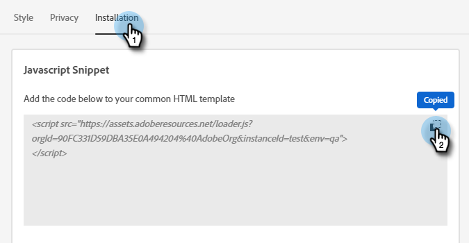

# Configuración {#configuration}

Aprenda a personalizar el aspecto de su ventana de diálogo de bots de chat.

Para empezar, haga clic en **Configuración**.

Existen varias opciones de personalización diferentes.

## Pestaña Estilo {#style-tab}

### Estilo {#style}

Aquí es donde definirá el aspecto del bot de chat en el que se mostrarán sus diálogos, incluidos: colores, fuentes, ubicación del widget bot y el nombre/avatar del bot de chat.

El color de cada categoría está determinado por una [valor de color hexadecimal](https://color.adobe.com/create/color-wheel) (por ejemplo, blanco = #ffffff, rojo = #bf1932, etc.).

El delimitador permite que el visitante del sitio abra o cierre el cuadro de diálogo. Puede elegir si desea que ese icono aparezca en la parte inferior derecha o inferior izquierda. También puede aumentar/disminuir el margen (la cantidad de espacio entre el icono y la parte inferior de la página web).

### Configuración del agente {#agent-settings}

En Configuración del agente, puede agregar una etiqueta a su chat (por ejemplo: &quot;Bot de Adobe&quot;) que aparecerá en la parte superior. También puede determinar el retraso de respuesta (en segundos) y cambiar el avatar de conversación. Para cargar su propia imagen de avatar, haga clic en el botón **+** botón.

>[!NOTE]
>
>Los avatares personalizados deben ser imágenes cuadradas inferiores a 256 kb y menores a 200 x 200 px. Los tipos de archivo admitidos son: .jpg, .png, .gif, .webp, .svg.

Cuando haya terminado de realizar cambios, recuerde hacer clic en **Guardar**.

## Ficha Privacidad {#privacy-tab}

Haga clic en el **Privacidad** para añadir o editar la dirección URL de la política de privacidad del sitio (opcional).

## Ficha Instalación {#installation-tab}

Para que el bot de chat aparezca en su sitio web, primero deberá instalar el fragmento de JavaScript de chat dinámico. Haga clic en esta pestaña para buscar/copiar el código necesario. Si no está familiarizado con esta operación, póngase en contacto con su equipo web o departamento de TI para obtener ayuda.

>[!TIP]
>
>Si su sitio utiliza una Política de seguridad de contenido, es posible que tenga que incluir en la lista blanca las siguientes direcciones URL para que el bot de chat funcione según lo esperado:
>
>* `*.adoberesources.net`
>* `*.adobe.io`
>* `*.typekit.net`

>[!NOTE]
>
>El servicio de asistencia técnica de Marketo no está configurado para ayudarle con el HTML de solución de problemas. Para obtener ayuda del HTML, consulte con un desarrollador web.
