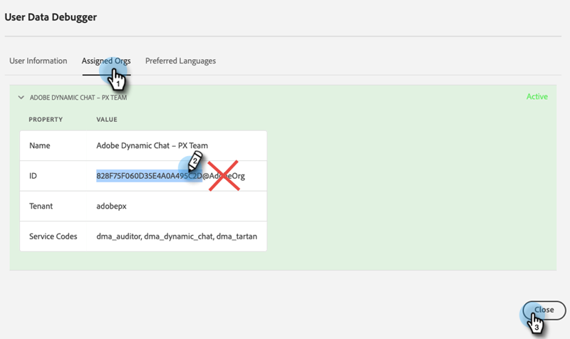

# Conexión de Dynamic Chat a Marketo {#connect-dynamic-chat-to-marketo}

Una vez que haya completado el [configuración inicial](/help/marketo/product-docs/demand-generation/dynamic-chat/initial-setup.md), es hora de realizar la sincronización de una sola vez que conecta Dynamic Chat con su suscripción a Marketo.

1. En Mi Marketo, haga clic en el botón **Chat dinámico** mosaico.

   

   >[!NOTE]
   >
   >Si no ve el mosaico, póngase en contacto con el administrador de Marketo.

1. Si anteriormente ha accedido a una aplicación con un Adobe ID, se le dirigirá directamente a Dynamic Chat. Si no, [configuración de Adobe ID](https://helpx.adobe.com/manage-account/using/create-update-adobe-id.html).

1. Para conectar la instancia de Marketo, seleccione **Integraciones**.

   

1. En la tarjeta Marketo, haga clic en **Iniciar sincronización**.

   

1. Seleccione hasta 50 campos estándar o personalizados de la instancia de Marketo para sincronizar con Dynamic Chat para utilizarlos en la segmentación de audiencias, la asignación de datos y la personalización. Haga clic en **Siguiente** cuando haya terminado.

   

   >[!CAUTION]
   >
   >En este momento, las selecciones de atributos **cannot** después de la sincronización inicial. Cuando haya terminado la sincronización, solo puede volver atrás y agregar más (si elige menos de 50).

1. Revise las selecciones (recordatorio: no puede quitar atributos después de la sincronización, por lo que haga clic en **Editar selecciones** si necesita cambiar alguno en este paso). Haga clic en **Confirmar** cuando haya terminado para iniciar la sincronización.

   

>[!NOTE]
>
>La sincronización puede tardar entre 2 y 24 horas en completarse, en función del tamaño de la base de datos.

## Vincular la organización de Adobe y Marketo {#link-your-adobe-org-and-marketo}

A continuación, es hora de vincular Adobe y Marketo.

1. Iniciar sesión en [experience.adobe.com](https://experience.adobe.com).

1. Copie el ID de organización desde la esquina inferior derecha de la página principal, _menos_ el &quot;@AdobeOrg.&quot;

   

1. En Marketo, vaya a la **Administrador** y seleccione **Asignación de organización de Adobe**.

   

1. Haga clic en **Editar**.

   

1. Pegue el identificador de organización que ha copiado en el paso 2 y haga clic en **OK**.

   

>[!MORELIKETHIS]
>
>[Configuración inicial](/help/marketo/product-docs/demand-generation/dynamic-chat/initial-setup.md)
