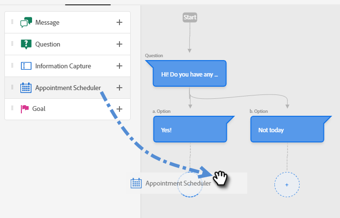
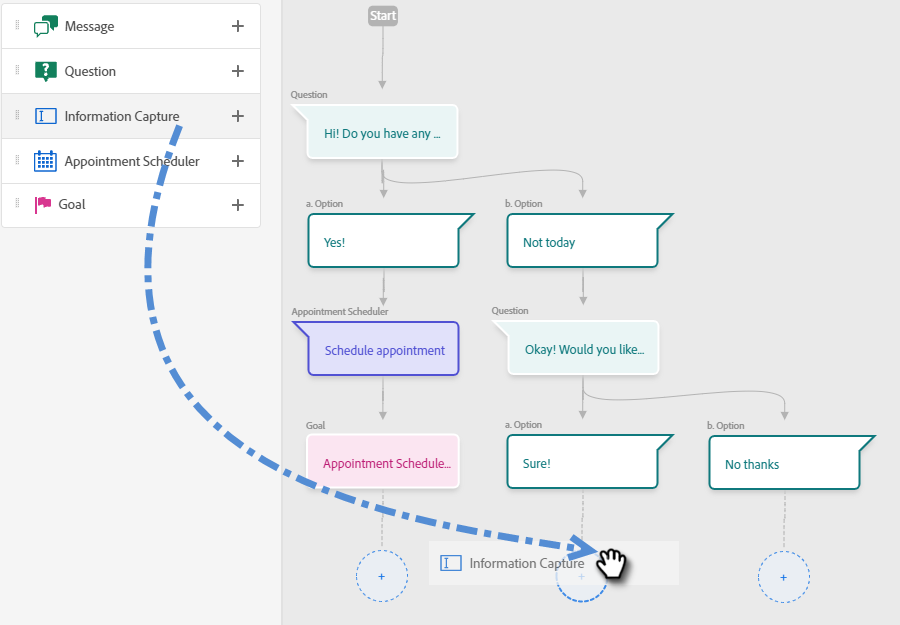

# Creación de un flujo {#create-a-stream}

Puede crear _muchas_ combinaciones de flujo. A continuación se muestra un ejemplo en el que el especialista en marketing pregunta al visitante del sitio si tiene alguna pregunta sobre el producto. Si es así, el visitante puede programar una cita. En caso negativo, se da al visitante la opción de unirse a una lista de correo para correspondencia futura. El objetivo es programar una cita o recopilar el correo electrónico del visitante.

1. Después de [crear el cuadro de diálogo](/help/marketo/product-docs/demand-generation/dynamic-chat/dialogues.md#create-a-new-dialogue), haga clic en la pestaña **Diseñador de flujo**.

   

1. Arrastre y suelte la tarjeta Pregunta .

   

1. En Respuesta de bots de chat, responda a su pregunta como le gustaría.

   

   >[!NOTE]
   >
   >El valor de Poke se establece en activado de forma predeterminada, lo que muestra la pregunta de apertura junto al icono de chat sin que el visitante tenga que hacer clic en él para verlo.

1. Introduzca sus respuestas de usuario y haga clic en **Save**.

   

1. Para &quot;Sí&quot; queremos programar una cita, así que debajo de esa opción, arrastre la tarjeta Programador de citas.

   

1. En la columna de la derecha, haga clic en **Save**.

   

1. Dado que es un objetivo, arrastre la tarjeta Goal debajo del Programador de citas.

   

1. Asigne un nombre al objetivo (o elija uno existente) y haga clic en **Guardar**.

   

1. Para &quot;No&quot; queremos ver si se unirán a la lista de correo, así que debajo de esa opción, arrastre sobre otra tarjeta de Pregunta.

   

1. Introduzca su respuesta y añada opciones de respuesta para el visitante. Haga clic en **Guardar** cuando termine.

   

   >[!NOTE]
   >
   >Para agregar más respuestas, haga clic en **Agregar respuesta**.

1. Debajo de la respuesta &quot;Sí&quot;, arrastre la tarjeta Captura de información para poder recopilar el correo electrónico del visitante.

   

1. Haga clic en la lista desplegable **Type** y seleccione **Email**.

   

1. Introduzca un mensaje de bots de chat y un marcador de posición. Asegúrese de que el atributo esté asignado al campo correspondiente en Marketo y haga clic en **Guardar**.

   

   <table>
    <tr>
     <td><strong>Tipo</strong></td>
     <td>El tipo de información que desea capturar: Teléfono, Texto, Correo electrónico.</td>
    </tr>
    <tr>
     <td><strong>Mensaje de bots de chat</strong></td>
     <td>El mensaje que el visitante ve solicitándole que proporcione la información.</td>
    </tr>
    <tr>
     <td><strong>Marcador de posición</strong></td>
     <td>Texto de muestra que ayuda al visitante a ver qué introducir.</td>
    </tr>
    <tr>
     <td><strong>Asignar respuesta al atributo</strong></td>
     <td>Permite sincronizar la respuesta del visitante con el campo correspondiente de su registro de persona en la suscripción a Marketo.</td>
    </tr>
   </table>

1. Dado que la recopilación de su correo electrónico es un objetivo, arrastre la tarjeta de objetivo debajo de Captura de información.

   

1. Asigne un nombre al objetivo (o elija uno existente) y haga clic en **Guardar**.

   

1. Recuerde añadir una respuesta si dicen &quot;No&quot;. Arrastre una tarjeta Mensaje debajo de esa opción.

   

1. Introduzca el mensaje y haga clic en **Save**.

   

1. Cuando desee activar el cuadro de diálogo, haga clic en **Publicar**.

   

>[!NOTE]
>
>Antes de hacer clic en Publicar, recuerde asegurarse de que ha [introducido las URL de destino](help/marketo/product-docs/demand-generation/dynamic-chat/dialogues.md#target).

>[!MORELIKETHIS]
>
>[Cuadros de diálogo](/help/marketo/product-docs/demand-generation/dynamic-chat/dialogues.md)
