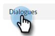
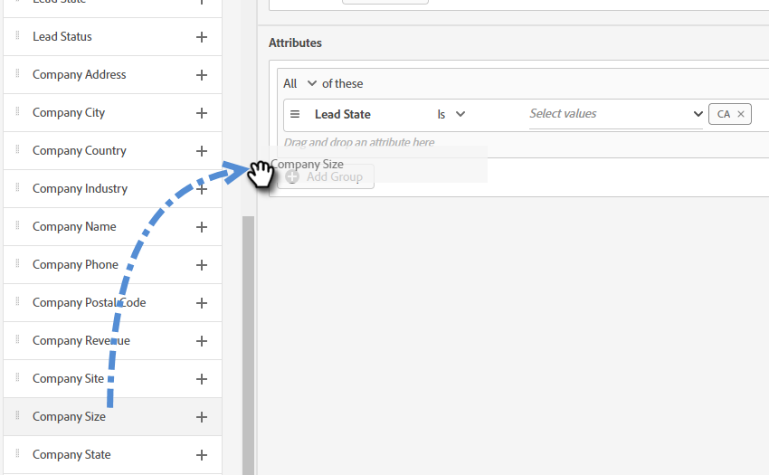

# Cuadros de diálogo {#dialogues}

Los diálogos son conversaciones individuales de chat. Aprenda a personalizarlos visualmente, a determinar en qué páginas aparecen y a decidir qué se dice y quién lo ve.

## Crear un cuadro de diálogo nuevo {#create-a-new-dialogue}

1. Haga clic en **Diálogos**.

   

1. Haga clic en el botón **Create New**.

   

1. Introduzca un nombre (la descripción es opcional), establezca el nivel de prioridad y haga clic en **Guardar**.

   

>[!NOTE]
>
>La prioridad determina qué diálogo se mostrará a un visitante cuando cumpla los requisitos para varios diálogos simultáneamente.

## Criterios de audiencia {#audience-criteria}

Al igual que las listas inteligentes de Marketo, los atributos de criterios de audiencia le permiten definir la audiencia de destino. Puede dirigirse a personas conocidas o desconocidas mediante atributos inferidos, personales o de empresa (o una combinación de estos).

**Personas conocidas**

Hay _muchas_ combinaciones de atributos entre las que elegir. En este ejemplo, estamos dirigiéndonos a todas las **personas conocidas** en California que trabajan en una empresa con más de 50 empleados.

1. Coja el atributo **Estado de la persona** y arrástrelo a la derecha.

   

1. __ Isis establecido de forma predeterminada. En el campo Seleccionar valores , escriba CA (también puede hacer clic en la lista desplegable y seleccionar en la lista).

   

1. Coja el atributo **Tamaño de la empresa** y arrástrelo hasta donde diga _arrastre y suelte un atributo aquí_.

   

   >[!NOTE]
   >
   >También puede elegir un atributo haciendo clic en su icono **+**.

1. Haga clic en la lista desplegable de operadores y seleccione **Bueno que**.

   

1. Escriba 50 y haga clic en cualquier otra parte de la pantalla para guardar.

   

**Personas anónimas**

Existe una manera fácil de dirigirse específicamente a personas que aún no están en su base de datos. En este ejemplo, estamos dirigiendo todos los **anónimos** ubicados en el área de Nueva York.

1. Coja el atributo **Personson Email** y arrástrelo a la derecha.

   

1. Haga clic en la lista desplegable de operadores y seleccione **Is Empty**.

   

1. Coja el atributo **Estado preferido** y arrástrelo hasta el lugar donde dice _arrastre y suelte un atributo aquí_.

   

   >[!NOTE]
   >
   >Cuando alguien visita su sitio web, [Munchkin](/help/marketo/product-docs/administration/additional-integrations/add-munchkin-tracking-code-to-your-website.md) las cookies y las coloca en el sistema. Buscamos su IP en una base de datos especial e infamos todo tipo de información buena.

1. __ Isis establecido de forma predeterminada. En el campo Seleccionar valores , escriba NY (también puede hacer clic en la lista desplegable y seleccionar en la lista).

   

## Agregar grupos {#add-groups}

También tiene la opción de agrupar atributos, en caso de que desee tener todos los atributos junto con &quot;todos o cualquiera&quot; de otro. Puede agregar varios grupos.

## Destino {#target}

Aquí es donde introduce las direcciones URL en las que desea que se muestre un cuadro de diálogo específico.

Formatos aceptables:

* `http://website.com`
* `https://*.website.com`
* `http://website.com/folder/*`
* `https://*.website.com/folder/*`

>[!NOTE]
>
>El uso de un asterisco actúa como comodín global. Por lo tanto, `https://*.website.com` colocaría el cuadro de diálogo en todas las páginas del sitio, incluidos los subdominios (por ejemplo: `support.website.com`). Y `https://website.com/folder/*` colocaría el cuadro de diálogo en cada página del HTML de la carpeta siguiente (por ejemplo: en este caso, digamos que la carpeta es &quot;deportes&quot;, así que: website.com/sports/baseball.html, website.com/sports/football.html, etc.).

## Diseñador de secuencias {#stream-designer}

El diseñador de secuencias contiene diferentes tarjetas que puedes añadir para dar forma a la conversación de chat.

<table>
 <tr>
  <td><strong>Mensaje</strong></td>
  <td>Utilícelo cuando desee realizar una instrucción sin necesidad de respuesta (por ejemplo: "¡Hola! Todos los artículos tienen hoy un 25% de descuento con el código SAVE25").
</td>
 </tr>
 <tr>
  <td><strong>Pregunta</strong></td>
  <td>Utilícelo cuando desee hacer una pregunta de opción múltiple, de la que proporcione las respuestas disponibles (por ejemplo: ¿Qué tipo de vehículo le interesa? Respuestas = SUV, Compacta, Camión, etc.).</td>
 </tr>
 <tr>
  <td><strong>Captura de información</strong></td>
  <td>Utilícelo cuando desee recopilar información. Los tres campos entre los que elegir son Dirección de correo electrónico, Número de teléfono y Texto (que permite al visitante escribir su propio mensaje).</td>
 </tr>
 <tr>
  <td><strong>Programador de citas</strong></td>
  <td>Proporciona al visitante un calendario de fechas disponibles para programar un seguimiento. La disponibilidad del calendario refleja <a href="/help/marketo/product-docs/demand-generation/dynamic-chat/dynamic-chat-overview.md#routing">el siguiente agente en la línea</a>.</td>
 </tr>
 <tr>
  <td><strong>Objetivo</strong></td>
  <td>Esta es la única tarjeta que los visitantes no verán. Depende de usted determinar en qué momento se logra un objetivo dentro del chat específico (por ejemplo: si su objetivo es recopilar el correo electrónico del visitante, coloque la tarjeta Goal inmediatamente después de Captura de información en el flujo).</td>
 </tr>
</table>

**Creación de un flujo**

Existen _muchas_ combinaciones de flujo posibles. Veamos un ejemplo [en este artículo](/help/marketo/product-docs/demand-generation/dynamic-chat/create-a-stream.md).

## Informes {#reports}

En la pestaña Informes , vea los datos de los últimos 90 días. Cada categoría se define a continuación.

<table>
 <tr>
  <td><strong>Total activado</strong></td>
  <td>Incrementa cada vez que un visitante se califica para/se muestra en un cuadro de diálogo.
</td>
 </tr>
 <tr>
  <td><strong>Comprometido</strong></td>
  <td>Incrementa cada vez que un visitante hace clic en el anclaje de bots de chat para abrir el Diálogo.</td>
 </tr>
 <tr>
  <td><strong>Completado</strong></td>
  <td>Incrementa cada vez que un visitante llega al final de cualquier rama de un cuadro de diálogo.</td>
 </tr>
 <tr>
  <td><strong>Personas capturadas</strong></td>
  <td>Incrementa cada vez que un visitante proporciona una dirección de correo electrónico válida en un flujo de diálogo.</td>
 </tr>
 <tr>
  <td><strong>Reuniones reservadas</strong></td>
  <td>Incrementa cada vez que un visitante programa correctamente una cita a través del bot de chat.</td>
 </tr>
 <tr>
  <td><strong>Objetivos alcanzados</strong></td>
  <td>Incrementa cada vez que un visitante alcanza un objetivo en cualquier flujo de diálogo.</td>
 </tr>
</table>

>[!MORELIKETHIS]
>
>[Creación de un flujo](/help/marketo/product-docs/demand-generation/dynamic-chat/create-a-stream.md)
