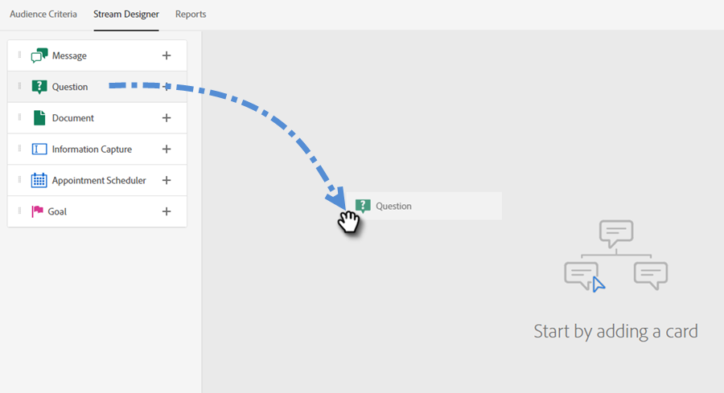

# Diseñador de secuencias {#stream-designer}

Hay _many_ combinaciones de flujo posibles. Este artículo contiene un ejemplo en el que el especialista en marketing pregunta al visitante del sitio si tiene alguna pregunta sobre el producto. Si es así, el visitante puede programar una cita. En caso negativo, se da al visitante la opción de unirse a una lista de correo para correspondencia futura. También se les ofrece un PDF gratuito. El objetivo final es programar una cita o recopilar el correo electrónico del visitante.

>[!PREREQUISITES]
>
>Para poder usar la tarjeta Documento, primero debe [configuración](/help/marketo/product-docs/demand-generation/dynamic-chat/integrations/using-the-document-card.md){target=&quot;_blank&quot;} en la cuenta de Adobe.

## Tarjetas de Diseñador de secuencias {#stream-designer-cards}

El diseñador de secuencias contiene varias tarjetas que puede agregar para dar forma a la conversación de chat.

<table>
 <tr>
  <td><strong>Mensaje</strong></td>
  <td>Utilícelo cuando desee realizar una instrucción sin necesidad de respuesta (por ejemplo: "¡Hola! Todos los artículos tienen hoy un 25% de descuento con el código SAVE25").
</td>
 </tr>
 <tr>
  <td><strong>Pregunta</strong></td>
  <td>Utilícelo cuando desee hacer una pregunta de opción múltiple, de la que proporcione las respuestas disponibles (por ejemplo: ¿Qué tipo de vehículo le interesa? Respuestas = SUV, Compacta, Camión, etc.).</td>
 </tr>
 <tr>
  <td><strong>Documento</strong></td>
  <td>Permite incrustar documentos de PDF en cuadros de diálogo y rastrear la actividad de participación en los documentos de los visitantes (cuántas páginas se vieron, si se descargó el documento y/o cualquier término de búsqueda que se haya utilizado).</td>
 </tr>
 <tr>
  <td><strong>Captura de información</strong></td>
  <td>Utilícelo cuando desee recopilar información. Los tres campos entre los que elegir son Dirección de correo electrónico, Número de teléfono y Texto (que permite al visitante escribir su propio mensaje).</td>
 </tr>
 <tr>
  <td><strong>Planificador de citas</strong></td>
  <td>Proporciona al visitante un calendario de fechas disponibles para programar un seguimiento. La disponibilidad del calendario refleja <a href="/help/marketo/product-docs/demand-generation/dynamic-chat/dynamic-chat-overview.md#routing">el siguiente agente en línea</a>.</td>
 </tr>
 <tr>
  <td><strong>Objetivo</strong></td>
  <td>Esta es la única tarjeta que los visitantes no verán. Depende de usted determinar en qué momento se logra un objetivo dentro del chat específico (por ejemplo: si su objetivo es recopilar el correo electrónico del visitante, coloque la tarjeta Goal inmediatamente después de Captura de información en el flujo).</td>
 </tr>
</table>

## Creación de un flujo {#create-a-stream}

1. Después de [crear el cuadro de diálogo](/help/marketo/product-docs/demand-generation/dynamic-chat/dialogues/create-a-dialogue.md){target=&quot;_blank&quot;}, haga clic en el botón **Diseñador de secuencias** pestaña .

   

1. Arrastre y suelte la tarjeta Pregunta .

   

1. En Respuesta de bots de chat, responda a su pregunta como le gustaría.

   

   >[!NOTE]
   >
   >El valor de Poke se establece en activado de forma predeterminada, lo que muestra la pregunta de apertura junto al icono de chat sin que el visitante tenga que hacer clic en él para verlo. Poke solo está disponible en la primera tarjeta de la conversación.

1. Introduzca sus respuestas de usuario y haga clic en **Guardar**.

   

   >[!NOTE]
   >
   >**Editar valores almacenados** es un paso opcional para aquellos que deseen almacenar un valor diferente en la base de datos que el que se muestra a los visitantes en el bot de chat para los atributos asignados en la tarjeta de Pregunta (por ejemplo: El visitante ve &quot;Optimización del motor de búsqueda&quot;, y almacena ese valor como &quot;SEO&quot;).

1. Para &quot;Sí&quot; queremos programar una cita, así que debajo de esa opción, arrastre la tarjeta Programador de citas.

   

1. En la columna de la derecha, haga clic en **Guardar**.

   

1. Dado que es un objetivo, arrastre la tarjeta Goal debajo del Programador de citas.

   

1. Asigne un nombre al objetivo (o elija uno existente) y haga clic en **Guardar**.

   

1. Para &quot;No&quot; queremos ver si se unirán a la lista de correo, así que debajo de esa opción, arrastre sobre otra tarjeta de Pregunta.

   

1. Introduzca su respuesta y añada opciones de respuesta para el visitante. Haga clic en **Guardar** cuando haya terminado.

   

   >[!NOTE]
   >
   >Para agregar más respuestas, haga clic en **Agregar respuesta**.

1. Debajo de la respuesta &quot;Sí&quot;, arrastre la tarjeta Captura de información para poder recopilar el correo electrónico del visitante.

   

1. Haga clic en el **Tipo** y seleccione **Correo electrónico**.

   

1. Introduzca un mensaje de bots de chat y un marcador de posición. Asegúrese de que el atributo esté asignado al campo correspondiente en Marketo y haga clic en **Guardar**.

   

   <table>
    <tr>
     <td><strong>Tipo</strong></td>
     <td>El tipo de información que desea capturar: Teléfono, Texto, Correo electrónico.</td>
    </tr>
    <tr>
     <td><strong>Mensaje de chatbot</strong></td>
     <td>El mensaje que el visitante ve solicitándole que proporcione la información.</td>
    </tr>
    <tr>
     <td><strong>Marcador de posición</strong></td>
     <td>Texto de muestra que ayuda al visitante a ver qué introducir.</td>
    </tr>
    <tr>
     <td><strong>Asignar respuesta al atributo</strong></td>
     <td>Permite sincronizar la respuesta del visitante con el campo correspondiente de su registro de persona en la suscripción a Marketo.</td>
    </tr>
   </table>

1. Dado que la recopilación de su correo electrónico es un objetivo, arrastre la tarjeta de objetivo debajo de Captura de información.

   

1. Asigne un nombre al objetivo (o elija uno existente) y haga clic en **Guardar**.

   

1. Recuerde añadir una respuesta si dicen &quot;No&quot;. Una opción es arrastrar una tarjeta Mensaje abajo y decir &quot;gracias de todas formas&quot;. Pero en este ejemplo, les proporcionaremos un documento PDF gratuito.

   

1. En este ejemplo crearemos un nuevo documento. Asígnele un nombre, introduzca la dirección URL del PDF que ya ha alojado y haga clic en **Guardar**.

   

1. Seleccione el **Vista previa** alterne para obtener una vista previa del cuadro de diálogo.

   

1. Cuando esté listo para activar el cuadro de diálogo, haga clic en **Publicación**.

   

>[!NOTE]
>
>Antes de hacer clic en Publicar, recuerde asegurarse de que ha [ha introducido las direcciones URL de destino](/help/marketo/product-docs/demand-generation/dynamic-chat/dialogues/audience-criteria.md#target){target=&quot;_blank&quot;}.

>[!MORELIKETHIS]
>
>* [Crear un cuadro de diálogo](/help/marketo/product-docs/demand-generation/dynamic-chat/dialogues/create-a-dialogue.md){target=&quot;_blank&quot;}
>* [Criterios de audiencia](/help/marketo/product-docs/demand-generation/dynamic-chat/dialogues/audience-criteria.md){target=&quot;_blank&quot;}
>* [Informes](/help/marketo/product-docs/demand-generation/dynamic-chat/dialogues/reports.md){target=&quot;_blank&quot;}
>* [Uso de la tarjeta de documento](/help/marketo/product-docs/demand-generation/dynamic-chat/dialogues/using-the-document-card.md){target=&quot;_blank&quot;}

