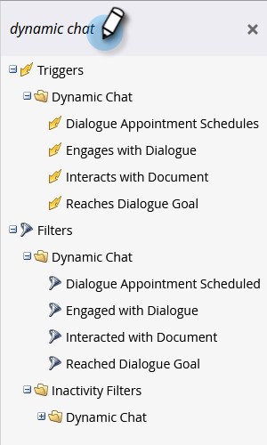

# [!DNL Dynamic Chat] actividades {#dynamic-chat-activities}

[!DNL Dynamic Chat] ofrece varios filtros y déclencheur para usarlos en sus listas inteligentes.

## Definiciones {#definitions}

<table>
<thead>
<tbody>
  <tr>
    <td style="width:25%"><b>Desencadenado</b></td>
    <td>Un evento de déclencheur se produce cuando un visitante cumple los criterios de segmentación de un flujo de diálogo o conversación y se muestra en el cuadro de diálogo.
     Un evento de déclencheur por visitante y por sesión.</td>
  </tr>
  <tr>
    <td style="width:25%"><b>Participación con un flujo/diálogo de conversación</b></td>
    <td>La primera vez que un visitante web hace clic en un mensaje en un flujo de diálogo o conversación (haciendo clic en una opción de opción múltiple, enviando información, reservando una reunión, abriendo un documento, etc.) se produce una participación. Si un visitante abre un diálogo o un flujo de conversación, pero no hace clic en un mensaje, se registra una participación de <b>no</b>.
     Un evento de participación por visitante y por sesión.</td>
  </tr>
   <tr>
    <td style="width:25%"><b>Comprometido con un agente</b></td>
    <td>Sucede cuando un visitante se conecta correctamente a un agente de chat en directo.
     Un evento relacionado con el agente por visitante y por sesión.</td>
  </tr>
  <tr>
    <td style="width:25%"><b>Interactuó con el documento</b></td>
    <td>Sucede cuando un visitante hace clic en un documento de una tarjeta de documento.
     Puede haber varias interacciones de documentos por visitante y por sesión.</td>
  </tr>
  <tr>
    <td style="width:25%"><b>Meta(s) alcanzada(s)</b></td>
    <td>Sucede cuando un visitante alcanza una meta.  Puede haber varios eventos objetivo por visitante y por sesión.</td>
  </tr>
  <tr>
    <td style="width:25%"><b>Reunión programada</b></td>
    <td>Sucede cuando un visitante reserva una reunión con un agente de Dynamic Chat.
     Puede haber varios eventos reservados para reuniones por visitante y por sesión.</td>
  </tr>
</tbody>
</table>

## Cosas que hay que tener en cuenta {#things-to-note}

* Se admiten condiciones en [!DNL Dynamic Chat] pasos de flujo
* [!DNL Dynamic Chat] actividades se pueden sincronizar con [[!DNL Marketo Sales Insight]](/help/marketo/product-docs/marketo-sales-insight/msi-for-salesforce/features/dynamic-chat-integration.md){target="_blank"}
* Puede ver actividades individuales de [!DNL Dynamic Chat] en el registro de actividad de un registro de persona
