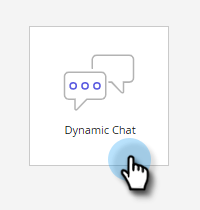

# Información general de [!DNL Dynamic Chat] {#dynamic-chat-overview}

Dynamic Chat le permite aprovechar una interfaz fácil de usar para dirigirse tanto a las personas como a las cuentas que visitan su sitio web. Recopile contenido relevante, como nombre, información de contacto y texto libre. Los visitantes del sitio también pueden chatear con un agente activo e incluso concertar reuniones con su equipo de ventas. Los datos de actividad y participación de Dynamic Chat se pueden utilizar para añadir miembros a programas de Marketo y actividades activadoras en canales múltiples.

>[!TIP]
>
>Visite [esta página](https://experienceleague.adobe.com/es/docs/marketo-learn/tutorials/dynamic-chat/dynamic-chat-overview#){target="_blank"} para ver vídeos de tutoriales de Dynamic Chat.

## Integraciones {#integrations}

Un componente clave de Dynamic Chat es su capacidad para interactuar de forma nativa con la suscripción de Marketo. Para aprovechar todas las capacidades de esta integración, primero debe iniciar la sincronización de datos. Según el tamaño de su base de datos de Marketo, la [sincronización única](/help/marketo/product-docs/demand-generation/dynamic-chat/integrations/adobe-marketo-engage.md){target="_blank"} inicial de los datos puede tardar hasta 24 horas en completarse.

Se sincroniza lo siguiente:

* Los datos de los campos de persona
* Los datos de los campos de compañía
* Los datos de actividad

## Los diálogos {#dialogues}

Los diálogos representan una participación individual en el chat. Se deben considerar como un contenedor con todo lo necesario para ofrecer un diálogo de chat atractivo para los visitantes de su sitio web. En cada diálogo, puede especificar en qué página o páginas desea que aparezca el diálogo, a quién desea que se muestre, y el contenido y flujo del propio diálogo. Además, puede encontrar métricas para ver el rendimiento del diálogo. [Más información sobre los diálogos](/help/marketo/product-docs/demand-generation/dynamic-chat/automated-chat/dialogue-overview.md){target="_blank"}.

## Configuración {#configuration}

En la pestaña Configuración, personalice la apariencia de los distintos diálogos. Cambie la fuente, los colores, el tiempo de respuesta y mucho más. [Más información sobre la configuración](/help/marketo/product-docs/demand-generation/dynamic-chat/setup-and-configuration/configuration.md){target="_blank"}.

## Calendario {#calendar}

Conecte el calendario de Outlook o Gmail para utilizarlo en la programación de citas en el bot de chat. [Más información sobre el calendario](/help/marketo/product-docs/demand-generation/dynamic-chat/setup-and-configuration/agent-settings.md#connect-calendar){target="_blank"}

## Reuniones {#meetings}

Aquí es donde verá todas las citas programadas por los visitantes del sitio web a través de los distintos diálogos. [Más información sobre las reuniones](/help/marketo/product-docs/demand-generation/dynamic-chat/meeting-list.md){target="_blank"}

## Enrutamiento {#routing}

Aquí puede ver una lista de todos los agentes que han conectado sus calendarios, el orden en que se presentarán a los visitantes del sitio web y la creación de reglas de enrutamiento personalizadas. [Más información sobre el enrutamiento](/help/marketo/product-docs/demand-generation/dynamic-chat/setup-and-configuration/routing.md){target="_blank"}

## Chat en directo {#live-chat}

Ofrezca a sus visitantes web cualificados que se conecten con sus representantes de ventas a través del [chat en directo](/help/marketo/product-docs/demand-generation/dynamic-chat/live-chat/live-chat-overview.md){target="_blank"}.

## Flujo conversacional {#conversational-flow}

[Diseñe una conversación](/help/marketo/product-docs/demand-generation/dynamic-chat/automated-chat/conversational-flow-overview.md){target="_blank"} que un visitante pueda activar según la acción que designe (por ejemplo, rellenar un formulario, hacer clic en un vínculo, etc.).

## IA generativa {#generative-ai}

En Adobe Dynamic Chat, la [IA generativa](/help/marketo/product-docs/demand-generation/dynamic-chat/generative-ai/overview.md){target="_blank"} procesa las señales de intención, las preferencias del usuario y el comportamiento anterior en tiempo real para generar mensajes relevantes y personalizados para los visitantes del chat.

## Cambio de idioma {#changing-the-language}

Siga los pasos indicados a continuación para cambiar el idioma de Dynamic Chat.

>[!IMPORTANT]
>
>Si cambia el idioma en el nivel de perfil, se cambiará el idioma de _todas_ las aplicaciones de Experience Cloud, no solo de [!DNL Dynamic Chat].

1. En su cuenta de Experience Cloud, haga clic en el icono de configuración y elija **[!UICONTROL Preferencias]**.

   

1. Haga clic en el idioma actual indicado debajo de su dirección de correo electrónico.

   

1. Elija el idioma nuevo (un segundo idioma es opcional) y haga clic en **[!UICONTROL Guardar]**.

   

   >[!NOTE]
   >
   >Hay varias docenas de idiomas entre los que elegir, pero [!DNL Dynamic Chat] solo admite los siguientes: inglés, francés, alemán, japonés, español, italiano, portugués de Brasil, coreano, chino simplificado y chino tradicional.

Al actualizar el idioma, todo cambia en la propia aplicación, excepto las palabras que haya rellenado personalmente (por ejemplo, las respuestas de flujo).

## Límites de retención de datos de Dynamic Chat {#dynamic-chat-data-retention-limits}

A continuación se muestran algunos de los límites o parámetros dentro de Dynamic Chat. Para obtener una lista completa, consulte la [página de descripción del producto](https://helpx.adobe.com/es/legal/product-descriptions/adobe-marketo-engage---product-description.html){target="_blank"} Marketo Engage.

<table>
  <th>Tipo de datos</th>
  <th>Periodo de retención</th>
 <tr>
  <td>Cliente potencial anónimo sin ninguna participación</td>
  <td>90 días</td>
 </tr>
 <tr>
  <td>Actividad de la meta</td>
  <td>24 meses</td>
 </tr>
 <tr>
  <td>Actividad del documento</td>
  <td>24 meses</td>
 </tr>
 <tr>
  <td>Interacción con la actividad de diálogo</td>
  <td>90 días</td>
 </tr>
 <tr>
  <td>Actividad de reserva de reuniones</td>
  <td>24 meses</td>
 </tr>
</table>

## Preguntas frecuentes {#faq}

Consulte las [preguntas frecuentes sobre Dynamic Chat](/help/marketo/product-docs/demand-generation/dynamic-chat/faq.md){target="_blank"}.
