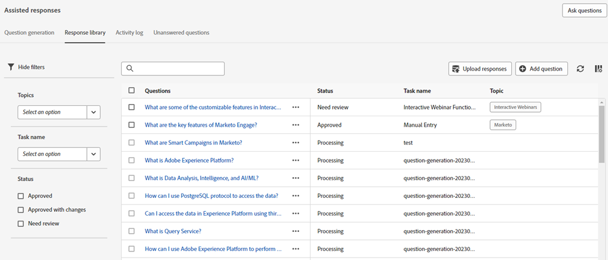
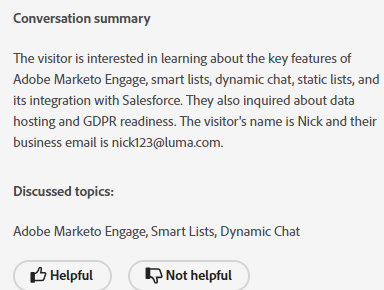
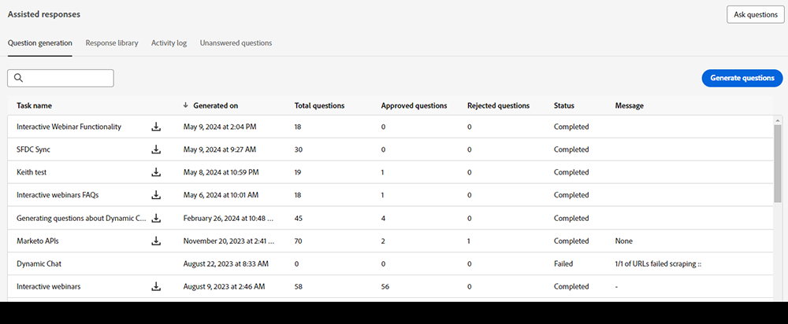
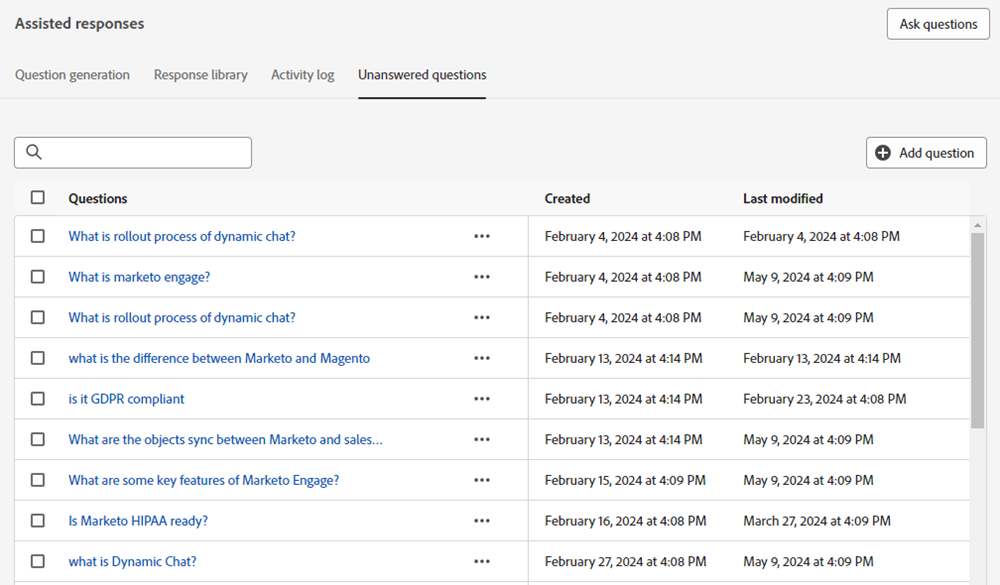
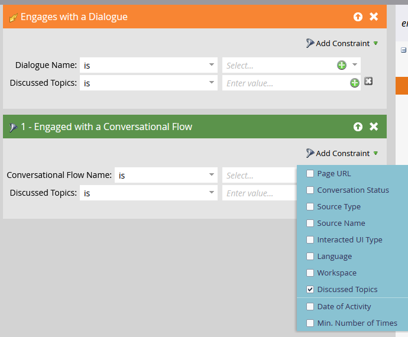

# IA generativa en Dynamic Chat {#generative-ai-overview}

Las funciones generativas impulsadas por IA de Adobe Dynamic Chat le permiten optimizar la productividad de sus agentes de ventas, obtener información sobre las intenciones de los visitantes de su sitio web y responder a las preguntas de los visitantes de forma segura.

## Permisos {#permissions}

Para usar IA generativa, conceda a los usuarios deseados los [permisos](/help/marketo/product-docs/demand-generation/dynamic-chat/setup-and-configuration/permissions.md) adecuados.

## Tarjeta de respuesta de generación {#generation-response-card}

Cree un mensaje para el visitante cuando llegue a un determinado punto de la conversación. Configure una serie de preguntas que pueden hacerse de una sola vez para lograr el indicador clave de rendimiento deseado. Añada hasta 5 preguntas de seguimiento e incluya un mensaje de reserva cuando no haya respuesta disponible a la pregunta de un visitante.

## Resumen de la conversación {#conversation-summary}

Normalmente, para obtener el contexto completo de una conversación con un visitante, debe desplazarse por toda la transcripción del chat. El resumen de la conversación genera un resumen en tiempo real e incluso incluye temas en los que el visitante expresó interés. Esto es particularmente útil para los agentes de chat que necesitan contexto rápido de una conversación cuando están cambiando entre chats con varios visitantes. Además de estar visibles en la pantalla de chat de la Bandeja de entrada del agente, los resúmenes de conversación completados también se pueden encontrar en el registro de actividad del registro de persona del visitante en la base de datos de Marketo Engage.

>[!NOTE]
>
>Se genera un resumen de la conversación tanto para los chats en vivo como para los automatizados.

## Generación de preguntas {#question-generation}

[Aumente las experiencias entrantes](/help/marketo/product-docs/demand-generation/dynamic-chat/generative-ai/question-generation.md) con conversaciones asistidas por IA para visitantes que utilizan una interfaz entrenada con conocimientos de ventas, marketing y productos.

## Biblioteca de respuestas {#response-library}

[Produzca una colección personalizada](/help/marketo/product-docs/demand-generation/dynamic-chat/generative-ai/response-library.md) de preguntas y respuestas, todas preaprobadas por usted, para usarlas dentro de las campañas de chat de inteligencia artificial aplicada a la generación.

## Registro de actividades {#activity-log}

[Ver una lista de todas las tareas](/help/marketo/product-docs/demand-generation/dynamic-chat/generative-ai/activity-log.md) y los detalles que las acompañan, incluidos el nombre, el propietario, el tipo, quién las editó y cuándo.

## Preguntas sin respuesta {#unanswered-questions}

[Cree respuestas preaprobadas adicionales](/help/marketo/product-docs/demand-generation/dynamic-chat/generative-ai/unanswered-questions.md) para su biblioteca de respuestas mediante IA en función de un repositorio de preguntas sin responder de conversaciones anteriores.

## Temas tratados {#discussed-topics}

Los temas abordados están disponibles en los déclencheur y filtros de listas inteligentes como restricción, lo que le permite explorar en profundidad las perspectivas de Dynamic Chat.

>[!IMPORTANT]
>
>Cuando utilice IA generativa, debe cumplir las [Directrices del usuario de IA generativa de Adobe Experience Cloud](https://www.adobe.com/legal/licenses-terms/adobe-dx-gen-ai-user-guidelines.html) para garantizar que las funciones de Adobe Experience Cloud que incorporan IA generativa se utilicen de forma segura y responsable.

## Preguntas frecuentes {#faq}

**¿Está disponible la IA generativa para todos los usuarios de Dynamic Chat?**

La IA generativa solo está disponible para suscriptores de Prime de Dynamic Chat. Póngase en contacto con el equipo de cuenta de Adobe (su administrador de cuentas) para obtener más información.

**¿Hay un límite en la cantidad de preguntas y respuestas que puedo haber generado?**

Sí. Hay un límite de duración de 1000 en este momento.

**¿Qué idiomas están disponibles en IA generativa?**

Actualmente, solo se admite inglés en la IA generativa.
