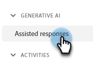

# Generación de preguntas {#question-generation}

Vea todas las tareas y sus detalles pertinentes, como cuándo se generaron, la cantidad total de preguntas, el estado de aprobación y más.

## Generar preguntas {#generate-questions}

1. En IA generativa, haga clic en **[!UICONTROL Respuestas asistidas]**.

   

1. Clic **[!UICONTROL Generación de preguntas]**.

   

1. Asigne un nombre a la tarea e introduzca una dirección URL de origen (hasta 10) desde la que se extraerá todo el contenido. Introduzca los temas/palabras clave deseados y pulse Enter en el teclado. Cuando termine, haga clic en **[!UICONTROL Generar]**.

   

   >[!IMPORTANT]
   >
   >Para garantizar que el Marketo Engage pueda crear secuencias de comandos de contenido desde las direcciones URL proporcionadas, primero debe realizar la lista de permitidos de varias direcciones IP. [Consulte a continuación para obtener más información](#ip-addresses-to-allowlist).

   >[!NOTE]
   >
   >Los sitios o las páginas deben ser públicos (es decir, no estar ocultos tras un inicio de sesión) para que se pueda eliminar su información.

1. En función de su contenido, la generación de preguntas y respuestas puede tardar hasta 30 minutos. Clic **[!UICONTROL OK]**.

   

   >[!TIP]
   >
   >Pulse Actualizar para ver el último estado de la generación de preguntas.

   

## Descargar preguntas y respuestas {#download-questions-and-responses}

>[!NOTE]
>
>Las preguntas y respuestas generadas también se pueden ver en [Biblioteca de respuestas](/help/marketo/product-docs/demand-generation/dynamic-chat/generative-ai/response-library.md).

1. Busque la tarea deseada y haga clic en el icono de descarga junto a su nombre.

   

1. Busque la carpeta de descargas en el explorador y seleccione el archivo. Este aspecto puede variar según el explorador que utilice.

   

1. En el archivo de Excel, **[!DNL Task details]** muestra solo eso, varios detalles sobre la tarea, incluidas instrucciones sobre cómo agregar o editar preguntas o respuestas.

   

   >[!NOTE]
   >
   >Si decide añadir/editar preguntas y/o respuestas de forma masiva, [obtenga información sobre cómo volver a cargarlos aquí](/help/marketo/product-docs/demand-generation/dynamic-chat/generative-ai/response-library.md).

1. El **[!DNL Q&Rs]** proporciona detalles adicionales, incluidas las preguntas y respuestas generadas.

   

## Direcciones IP para Lista de permitidos {#ip-addresses-to-allowlist}

Para permitir la extracción de contenido de las URL de su web durante la generación de preguntas y respuestas, busque su región a continuación y asegúrese de que el equipo web incluida en la lista de permitidos la dirección IP asociada con ella.

<table width="450">
<thead>
  <tr>
    <th>América del Norte</th>
    <th>Europa</th>
    <th>APAC</th>
  </tr>
</thead>
<tbody>
  <tr>
    <td>13.68.17.252</td>
    <td>20.105.150.224</td>
    <td>20 213 91 77</td>
  </tr>
</tbody>
</table>
