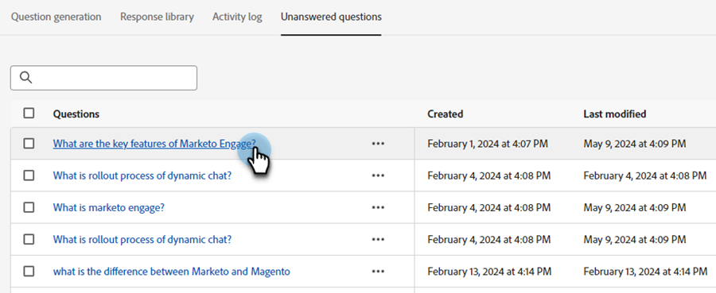

# Preguntas sin responder {#unanswered-questions}

Vea todas las preguntas que el bot de chat no pudo responder y/o las que los visitantes marcaron como &quot;no útiles&quot; y use esta valiosa información para crear respuestas preaprobadas adicionales.

>[!NOTE]
>
>La lista de preguntas sin responder se actualiza automáticamente cada 24 horas, a medianoche PST.

1. En IA generativa, haga clic en **[!UICONTROL Respuestas asistidas]**.

   

1. Haga clic en **[!UICONTROL Preguntas sin responder]** pestaña.

   

1. Seleccione la pregunta sin responder para la que desee crear una respuesta.

   

1. Introduzca su respuesta. Asigne un tema y añada una dirección URL opcional que los usuarios puedan compartir con los visitantes. Haga clic en **[!UICONTROL Guardar]** cuando termine.

   

1. La pregunta sin responder ahora se contesta y se añade automáticamente a la biblioteca de respuestas.

   
