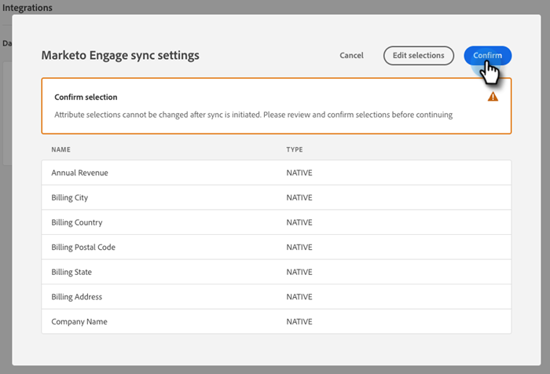

# Adobe Marketo Engage {#adobe-marketo-engage}

## Dynamic Chat de conexión {#connecting-dynamic-chat}

Una vez que haya completado la [configuración inicial](/help/marketo/product-docs/demand-generation/dynamic-chat/setup-and-configuration/initial-setup.md){target="_blank"}Sin embargo, es hora de realizar la sincronización única conectando el Dynamic Chat a su suscripción de Adobe Marketo Engage.

>[!NOTE]
>
>El Dynamic Chat admite la sincronización [nativo de Marketo](https://developers.marketo.com/rest-api/lead-database/fields/list-of-standard-fields/){target="_blank"} y campos de persona personalizados y campos de compañía.

1. En Mi Marketo, haga clic en **[!UICONTROL Dynamic Chat]** mosaico.

   

   >[!NOTE]
   >
   >Si no ve el mosaico, póngase en contacto con su administrador de Marketo.

1. Si ya ha accedido a una aplicación con un Adobe ID, se le redirigirá directamente a Dynamic Chat. Si no es así, [configuración de Adobe ID](https://helpx.adobe.com/manage-account/using/create-update-adobe-id.html){target="_blank"}.

1. Para conectar la instancia de Marketo, seleccione **[!UICONTROL Integraciones]**.

   

1. En la tarjeta Marketo, haga clic en **[!UICONTROL Iniciar sincronización]**.

   

1. Seleccione hasta 50 atributos (campos estándar o personalizados) de la instancia de Marketo para sincronizarlos con el Dynamic Chat y utilizarlos en la segmentación de audiencia, la asignación de datos y la personalización. Clic **[!UICONTROL Siguiente]** cuando termine.

   

1. Revise las selecciones. Clic **[!UICONTROL Confirmar]** para iniciar la sincronización.

   

>[!NOTE]
>
>La sincronización puede tardar entre 2 y 24 horas en completarse, según el tamaño de la base de datos.

## Añadir un atributo {#add-an-attribute}

Después de la sincronización inicial, así es como se agregan atributos adicionales.

1. Entrada **[!UICONTROL Integraciones]**, asegúrese de que la **[!UICONTROL Adobe Marketo Engage]** y haga clic en. **[!UICONTROL Añadir atributo]**.

   

1. Seleccione los atributos que desee añadir y haga clic en **[!UICONTROL Siguiente]**.

   

1. Revise las selecciones y haga clic en **[!UICONTROL Confirmar]**.

   

## Quitar un atributo {#remove-an-attribute}

Después de la sincronización inicial, así es como se elimina un atributo.

>[!NOTE]
>
>Solo verá la opción para quitar un atributo si actualmente ningún cuadro de diálogo lo está utilizando.

1. Entrada **[!UICONTROL Integraciones]**, asegúrese de que la **[!UICONTROL Adobe Marketo Engage]** La pestaña está seleccionada y haga clic en el atributo que desea eliminar.

   

1. Clic **[!UICONTROL Quitar atributo]**.

   

>[!MORELIKETHIS]
>
>[Configuración inicial](/help/marketo/product-docs/demand-generation/dynamic-chat/setup-and-configuration/initial-setup.md){target="_blank"}
