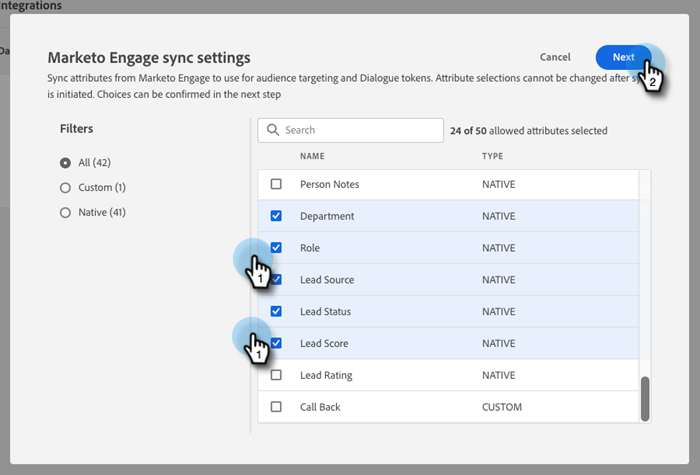
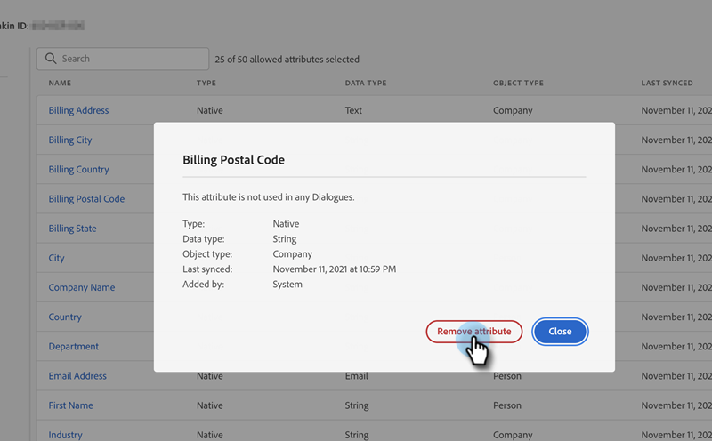

# Adobe Marketo Engage {#adobe-marketo-engage}

## Conexión de Dynamic Chat {#connecting-dynamic-chat}

Después de completar la [configuración inicial](/help/marketo/product-docs/demand-generation/dynamic-chat/setup-and-configuration/initial-setup.md){target="_blank"}, es hora de realizar la sincronización única conectando Dynamic Chat a tu suscripción de Adobe Marketo Engage.

>[!NOTE]
>
>Dynamic Chat admite la sincronización de [campos nativos de Marketo](https://experienceleague.adobe.com/es/docs/marketo-developer/marketo/rest/lead-database/field-types){target="_blank"}, de persona personalizada y de compañía.

1. En Mi Marketo, haga clic en el mosaico **[!UICONTROL Dynamic Chat]**.

   

   >[!NOTE]
   >
   >Si no ve el mosaico, póngase en contacto con su administrador de Marketo.

1. Si anteriormente ha accedido a una aplicación con un Adobe ID, se le redirigirá directamente a Dynamic Chat. Si no es así, [configure su Adobe ID](https://helpx.adobe.com/es/manage-account/using/create-update-adobe-id.html){target="_blank"}.

1. Para conectar tu instancia de Marketo, selecciona **[!UICONTROL Integraciones]**.

   

1. En la tarjeta Marketo, haga clic en **[!UICONTROL Iniciar sincronización]**.

   

1. Seleccione hasta 50 atributos (campos estándar o personalizados) de la instancia de Marketo para sincronizarlos con Dynamic Chat y utilizarlos en la segmentación de audiencia, asignación de datos y personalización. Haga clic en **[!UICONTROL Siguiente]** cuando haya terminado.

   

1. Revise las selecciones. Haga clic en **[!UICONTROL Confirmar]** para iniciar la sincronización.

   

>[!NOTE]
>
>La sincronización puede tardar entre 2 y 24 horas en completarse, según el tamaño de la base de datos.

## Añadir un atributo {#add-an-attribute}

Después de la sincronización inicial, así es como se agregan atributos adicionales.

1. En **[!UICONTROL Integraciones]**, asegúrese de que la ficha **[!UICONTROL Adobe Marketo Engage]** esté seleccionada y haga clic en **[!UICONTROL Agregar atributo]**.

   

1. Seleccione los atributos que desee agregar y haga clic en **[!UICONTROL Siguiente]**.

   

1. Revisa tus selecciones y haz clic en **[!UICONTROL Confirmar]**.

   

## Quitar un atributo {#remove-an-attribute}

Después de la sincronización inicial, así es como se elimina un atributo.

>[!NOTE]
>
>Solo verá la opción para quitar un atributo si actualmente ningún cuadro de diálogo lo está utilizando.

1. En **[!UICONTROL Integraciones]**, asegúrese de que la ficha **[!UICONTROL Adobe Marketo Engage]** esté seleccionada y haga clic en el atributo que desee quitar.

   

1. Haga clic en **[!UICONTROL Quitar atributo]**.

   

>[!MORELIKETHIS]
>
>[Configuración inicial](/help/marketo/product-docs/demand-generation/dynamic-chat/setup-and-configuration/initial-setup.md){target="_blank"}
