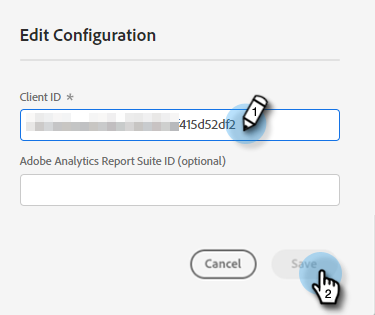

# API de inserción de Adobe PDF {#adobe-pdf-embed-api}

La tarjeta de documento permite incrustar documentos del PDF en los cuadros de diálogo y rastrear la actividad de participación de visitantes en los documentos. A continuación se muestra cómo configurarlo.

1. Vaya a [API de incrustación de Adobe PDF](https://udp.adobe.io/document-services/apis/pdf-embed/){target="_blank"}.

1. Clic **Obtener credenciales**.

   

1. Inicie sesión en su cuenta de Adobe.

   

1. Introduzca sus credenciales, acepte los términos y haga clic en **Crear credenciales**.

   

   >[!IMPORTANT]
   >
   >Deberá utilizar el dominio en el que alojará el bot de chat (por ejemplo, si aloja el bot de chat en mycompany.com, asegúrese de introducirlo en el paso 4).

1. Clic **Copiar** para copiar el ID de cliente.

   

1. Vuelva al Dynamic Chat y haga clic en **Integraciones**. En la tarjeta de API de incrustación de Adobe PDF, haga clic en **Activar**.

   

1. Pegue el ID de cliente y haga clic en **Guardar**.

   

Ahora puede utilizar la tarjeta de documento en los cuadros de diálogo [Diseñador de secuencias](/help/marketo/product-docs/demand-generation/dynamic-chat/automated-chat/stream-designer.md){target="_blank"}!

