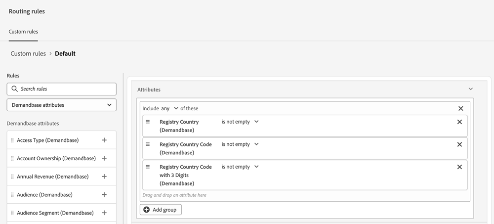

# Demandbase {#demandbase}

Los usuarios de Demandbase pueden utilizar los atributos de persona de Demandbase para la segmentación de diálogos, la promoción condicional de la marca y el enrutamiento personalizado en Dynamic Chat.

## Acceso a la clave de API para Dynamic Chat {#access-the-api-key-for-dynamic-chat}

Los pasos siguientes se deben seguir _en su cuenta de Demandbase_.

1. En Demandbase, haga clic en el icono _Configuración_.

   

1. En _Integraciones_, seleccione **Conector de cuenta**.

1. Haga clic en el botón **+ Crear nuevo**.

1. En el menú desplegable _Nombre de integración_, seleccione **Adobe Dynamic Chat**.

1. Seleccione el botón de opción **Servidor**.

1. Haga clic en **Crear**.

1. Con el icono _copiar_, copie la cadena de token de API en la parte inferior de la página.

1. Envíe un ticket con [Soporte técnico de Marketo](https://nation.marketo.com/t5/support/ct-p/Support) y proporcione la cadena de token de API para activar la integración con Demandbase.

>[!NOTE]
>
>Para obtener más información, consulte [Configuración de Demandbase para enviar datos a una integración (conector de cuenta)](https://support.demandbase.com/hc/en-us/articles/360057169531-Set-Up-Demandbase-to-Send-Data-to-an-Integration-Account-Connector){target="_blank"} en el sitio de ayuda de Demandbase.

## Funciones de integración {#integration-features}

Dirija la audiencia a según los atributos de Demandbase, además de los atributos nativos y personalizados, al crear un cuadro de diálogo o un flujo conversacional.

Utilice los atributos de Demandbase como una condición en la ramificación condicional, un cuadro de diálogo o un flujo conversacional.

Utilice los Atributos de Demandbase al definir cualquier lógica de enrutamiento personalizada.

