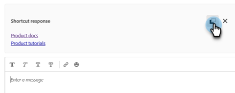

# Bandeja de entrada del agente {#agent-inbox}

Los agentes realizarán charlas en directo en la bandeja de entrada del agente. Además de las conversaciones activas, pueden ver conversaciones pasadas, información del visitante, etc.

## Alternancia de disponibilidad {#availability-toggle}

En la parte superior derecha de la pantalla Bandeja de entrada del agente, tiene la opción de establecer el estado como disponible o no disponible.

>[!IMPORTANT]
>
>**Esto anulará** la [disponibilidad de chat en vivo](/help/marketo/product-docs/demand-generation/dynamic-chat/setup-and-configuration/agent-settings.md#live-chat-availability){target="_blank"} que estableciste en la configuración del agente. El estado permanecerá hasta que vuelva a cambiarlo o hasta el siguiente bloque de tiempo de su disponibilidad.

>[!NOTE]
>
>Si establece su estado como no disponible, los chats activos no se verán afectados.

## Notificaciones de chat en directo {#live-chat-notifications}

Obtenga más información acerca de las notificaciones en [Información general de Live Chat](/help/marketo/product-docs/demand-generation/dynamic-chat/live-chat/live-chat-overview.md#live-chat-notifications){target="_blank"}.

## Conversaciones {#conversations}

A la izquierda de la pantalla Bandeja de entrada del agente, puede elegir mostrar sólo las conversaciones activas o todas ellas.

>[!NOTE]
>
>Aunque puede ver conversaciones pasadas (inactivas) de usted y de otros agentes, solo podrá ver sus propias conversaciones activas.

## Información del visitante {#visitor-information}

A la derecha de la pantalla de la bandeja de entrada del agente, podrá ver (de arriba a abajo) su nombre, cargo, dirección de correo electrónico, número de teléfono y estado de CRM. La información que no se haya transmitido se mostrará como un guión (-).

## Finalizar una sesión {#end-a-session}

Los agentes pueden finalizar manualmente una sesión simplemente haciendo clic en el botón **Finalizar sesión** situado junto a la información del visitante.

## Métodos abreviados {#shortcuts}

>[!NOTE]
>
>Esta función forma parte de la IA generativa, disponible mediante la suscripción a Dynamic Chat Prime. Póngase en contacto con el equipo de cuenta de Adobe (su administrador de cuentas) para obtener más información.

Los métodos abreviados, con la tecnología de IA generativa [biblioteca de respuestas](/help/marketo/product-docs/demand-generation/dynamic-chat/generative-ai/response-library.md), son una excelente manera de obtener ayuda sobre la marcha cuando se chatea con un visitante. Simplemente escriba una barra diagonal (`/`) en el cuadro de texto y elija `ask` o `search`.

**Preguntar** es para obtener ayuda con las respuestas a una pregunta.

1. Escriba o elija `/ask` en el cuadro de texto. Escriba su pregunta y pulse Enter en el teclado.

   

1. Aparecerá una respuesta. Haga clic en el icono Copiar para que se pegue automáticamente en el cuadro de texto. Puede editar el texto antes de enviarlo al visitante.

   

**Buscar** es para obtener ayuda para encontrar páginas relacionadas con texto específico.

1. Escriba o elija `/search` en el cuadro de texto.

   

1. Escriba lo que quiera buscar y pulse Enter en el teclado.

   

1. Aparecerán los vínculos aplicables. Haga clic en el icono Copiar para que se peguen automáticamente en el cuadro de texto. Puede realizar modificaciones antes de enviar la información al visitante.

   

## Historial de actividades {#activity-history}

Debajo de la información del visitante se encuentra el historial de actividades. Vea los tipos de actividades y las fechas, e incluso vea las transcripciones de chat.

>[!NOTE]
>
>Solo se muestra información de los últimos 90 días.

## Uso compartido de calendarios {#calendar-sharing}

En la parte inferior de la ventana de chat en vivo hay un icono que le permite compartir su calendario o el de otro agente con el visitante del chat.

1. Haga clic en el icono de calendario.

   

1. Elija el calendario del agente deseado y haga clic en **Enviar**.

   

1. El visitante del chat podrá reservar una reunión.

   

## Resumen de la conversación {#conversation-summary}

>[!NOTE]
>
>Esta función forma parte de la IA generativa, disponible mediante la suscripción a Dynamic Chat Prime. Póngase en contacto con el equipo de cuenta de Adobe (su administrador de cuentas) para obtener más información.

Resumen de la conversación genera un resumen rápido en tiempo real que incluye los temas por los que el visitante ha expresado interés. Está disponible en la parte inferior derecha de cada pantalla de chat.

>[!NOTE]
>
>También se puede encontrar un resumen de conversación completado en el registro de actividad del registro de persona del visitante en la base de datos de Marketo Engage.
