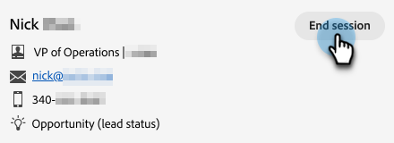

# Bandeja de entrada del agente {#agent-inbox}

Los agentes realizarán charlas en directo en la bandeja de entrada del agente. Además de las conversaciones activas, pueden ver conversaciones pasadas, información del visitante, etc.

## Alternancia de disponibilidad {#availability-toggle}

En la parte superior derecha de la pantalla Bandeja de entrada del agente, tiene la opción de establecer el estado como disponible o no disponible.

>[!IMPORTANT]
>
>**Esto anulará** el [disponibilidad de chat en vivo](/help/marketo/product-docs/demand-generation/dynamic-chat/setup-and-configuration/agent-settings.md#live-chat-availability){target="_blank"} ha establecido en Configuración de agente. El estado permanecerá hasta que vuelva a cambiarlo o hasta el siguiente bloque de tiempo de su disponibilidad.

>[!NOTE]
>
>Si establece su estado como no disponible, los chats activos no se verán afectados.

## Notificaciones de chat en directo {#live-chat-notifications}

Obtenga más información acerca de las notificaciones en la [Información general de Live Chat](/help/marketo/product-docs/demand-generation/dynamic-chat/live-chat/live-chat-overview.md#live-chat-notifications){target="_blank"}.

## Conversaciones {#conversations}

A la izquierda de la pantalla Bandeja de entrada del agente, puede elegir mostrar sólo las conversaciones activas o todas ellas.

>[!NOTE]
>
>Aunque puede ver conversaciones pasadas (inactivas) de usted y de otros agentes, solo podrá ver sus propias conversaciones activas.

## Información del visitante {#visitor-information}

A la derecha de la pantalla de la bandeja de entrada del agente, podrá ver (de arriba a abajo) su nombre, cargo, dirección de correo electrónico, número de teléfono y estado de CRM. La información que no se haya transmitido se mostrará como un guión (-).

## Historial de actividades {#activity-history}

Debajo de la información del visitante se encuentra el historial de actividades. Vea los tipos de actividades y las fechas, e incluso vea las transcripciones de chat.

>[!NOTE]
>
>Solo se muestra información de los últimos 90 días.

## Uso compartido de calendarios {#calendar-sharing}

En la parte inferior de la ventana de chat en vivo hay un icono que le permite compartir su calendario o el de otro agente con el visitante del chat.

1. Haga clic en el icono de calendario.

   

1. Seleccione el calendario del agente deseado y haga clic en **Enviar**.

   

1. El visitante del chat podrá reservar una reunión.

   
