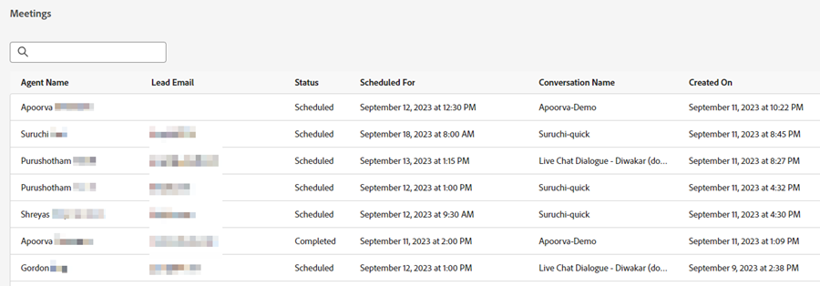

# Lista de reuniones {#meeting-list}

Aquí es donde verá todas las citas programadas por los visitantes del sitio web a través de los distintos cuadros de diálogo. Aquí encontrará la dirección de correo electrónico de la persona que reservó la cita, con qué agente reservó la cita, cuándo está programada la cita y si la hora de reunión programada ha pasado o no.

>[!NOTE]
>
>Cuando se reserva una reunión en el calendario de un agente, el agente recibe una notificación por correo electrónico sobre la reserva, que incluye información detallada sobre la participación del Dynamic Chat del visitante.
