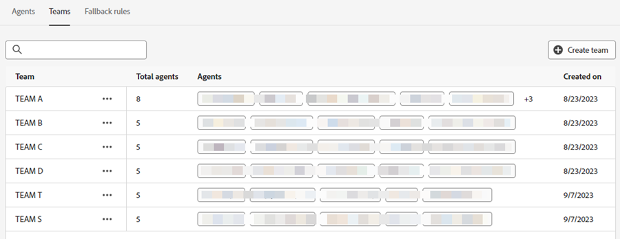
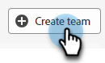

# Gestión de agentes {#agent-management}

En la administración de agentes, vea una lista de agentes en la instancia de Dynamic Chat, administre equipos y establezca reglas de reserva.

## Agentes {#agents}

Esta pestaña enumera todos los agentes de la instancia de Dynamic Chat e incluye información como el nombre, la dirección de correo electrónico, el estado del chat en vivo y más.

{width="800" zoomable="yes"}

>[!NOTE]
>
>Si un agente agregado recientemente no aparece aquí, podrían pasar hasta dos horas después de agregarlo en la Admin Console de Adobe.

## Equipos {#teams}

Los administradores pueden crear equipos de agentes para facilitar el envío a grupos específicos de agentes de ventas.

>[!AVAILABILITY]
>
>El acceso a los equipos requiere una suscripción a Dynamic Chat Prime. Póngase en contacto con el equipo de cuenta de Adobe (su administrador de cuentas) para obtener más información.

### Crear un equipo {#create-a-team}

1. Haga clic en **+ Crear equipo**.

   

1. Dé un nombre a su equipo.

   

1. Haga clic en el menú desplegable **Agregar agentes** y seleccione los agentes que desee.

   

1. Haga clic en **Crear**.

   

## Reglas de reserva {#fallback-rules}

### Reunión alternativa {#meeting-fallback}

Seleccione un mensaje estándar (del sistema) o escriba uno personalizado para que los visitantes vean cuándo no está disponible la reserva de la reunión.

### Live Chat Fallback {#live-chat-fallback}

Seleccione un mensaje estándar (del sistema) o escriba uno personalizado para que los visitantes vean cuándo Live Chat no está disponible.

>[!NOTE]
>
>* Si selecciona la casilla de verificación _Incluir opción de reserva de reunión_, el visitante del chat tendrá la opción de reservar una reunión cuando no haya agentes disponibles para el chat en vivo.
>
>* **Para cualquier regla o equipo personalizado como una tarjeta de Live Chat**: Al comprobar si hay agentes, si no están disponibles o no se pudieron conectar, volverá a Round Robin para intentar encontrar &quot;agentes disponibles&quot; (todos los que están disponibles en ese momento, independientemente de la lógica o regla de enrutamiento que se haya colocado en el flujo).

>[!TIP]
>
>Al crear un mensaje personalizado, puede aplicar estilo a la fuente, utilizar vínculos e incluso insertar emojis.

## Configuración {#settings}

### Límite de chats en directo simultáneos {#concurrent-live-chat}

Establece el número de chats activos simultáneos que un agente puede tomar al mismo tiempo. Puede establecer entre 1 y 10.

### Límite de tiempo de espera de visitante {#visitor-wait-time}

Controle la cantidad máxima de tiempo que un visitante esperará (en segundos) para conectarse a un agente activo antes de que el visitante reciba un mensaje de reserva. Puede ajustarse entre 10 y 500 segundos.

