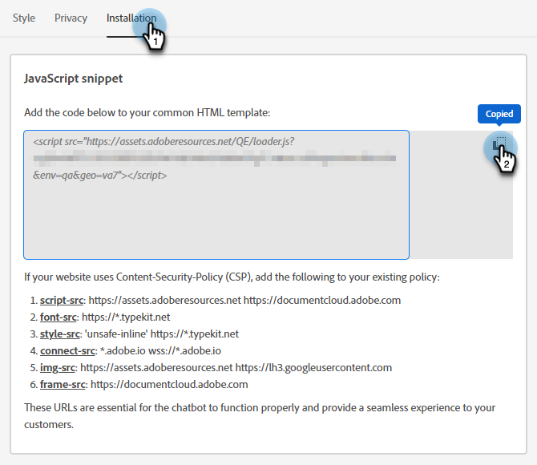

# Configuración {#configuration}

Aprenda a personalizar el aspecto de la ventana de diálogo del bot de chat.

Para empezar, haz clic en **Bot de chat** en **Configuración**.

Hay varias opciones de personalización diferentes.

## Pestaña Estilo {#style-tab}

### Estilo {#style}

Aquí es donde definirá el aspecto del bot de chat donde se mostrarán los cuadros de diálogo, incluidos: colores, fuentes, ubicación del widget del bot y el nombre/avatar del bot de chat.

El color de cada categoría está determinado por un [valor de color hexadecimal](https://color.adobe.com/create/color-wheel){target="_blank"} (por ejemplo, blanco = #ffffff, rojo = #bf1932, etc.).

El anclaje permite al visitante del sitio abrir/cerrar el cuadro de diálogo. Puede elegir si desea que ese icono aparezca en la parte inferior derecha o en la parte inferior izquierda. También puede aumentar/disminuir el relleno (la cantidad de espacio entre el icono y la parte inferior de la página web).

### Configuración de bots {#agent-settings}

En Configuración de bots, puede añadir una etiqueta a su cuadro de diálogo (por ejemplo: &quot;Adobe Assistant&quot;) que aparecerá en la parte superior. También puede determinar el retraso de la respuesta (en segundos) y cambiar el avatar del chat. Para cargar su propia imagen de avatar, haga clic en el botón **+**.

>[!NOTE]
>
>Los avatares personalizados deben ser imágenes cuadradas de menos de 256 kb y más pequeñas que 200 x 200 px. Los tipos de archivo admitidos son: .jpg, .png, .gif, .webp, .svg.

**Nuevo sonido de notificación de mensaje**

Haga clic en el menú desplegable para seleccionar un sonido para el visitante cada vez que se active el bot de chat en una sesión. Hay varios sonidos para elegir.

**Habilitar mensajes de poke en el móvil**

Seleccione el control deslizante para activar &quot;Poke&quot;, que muestra la pregunta de apertura junto al icono de chat sin que el visitante tenga que hacer clic para verla, para los visitantes que chatean desde un dispositivo móvil.

>[!NOTE]
>
>El Poke solo está disponible en la primera [tarjeta](/help/marketo/product-docs/demand-generation/dynamic-chat/automated-chat/stream-designer.md#stream-designer-cards){target="_blank"} de la conversación.

Cuando hayas terminado de hacer cambios, recuerda hacer clic en **Guardar**.

## Pestaña Privacidad {#privacy-tab}

Haga clic en la ficha **Privacidad** para agregar o editar la dirección URL de la directiva de privacidad del sitio (opcional).

## Pestaña Instalación {#installation-tab}

Para que el bot de chat aparezca en su sitio web, primero debe instalar el fragmento de JavaScript de Dynamic Chat. Haga clic en esta pestaña para buscar/copiar el código necesario. Si no está familiarizado con esta operación, póngase en contacto con su equipo web o departamento de TI para obtener ayuda.

>[!TIP]
>
>Busque debajo del código qué agregar si su sitio utiliza una Política de seguridad de contenido (CSP).

>[!NOTE]
>
>La asistencia de Marketo no está configurada para ayudar a solucionar problemas de HTML. Para obtener ayuda de HTML, consulte con un desarrollador web.
