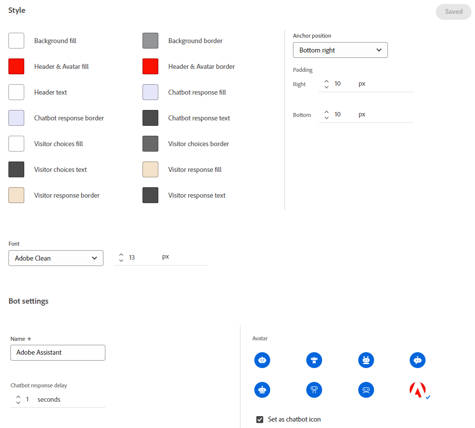

# Configuración {#configuration}

Aprenda a personalizar el aspecto de la ventana de diálogo del bot de chat.

Para empezar, haga clic en **Configuración**.

Hay varias opciones de personalización diferentes.

## Pestaña Estilo {#style-tab}

### Estilo {#style}

Aquí es donde definirá el aspecto del bot de chat donde se mostrarán los cuadros de diálogo, incluidos: colores, fuentes, ubicación del widget del bot y el nombre/avatar del bot de chat.

El color de cada categoría está determinado por una [valor de color hexadecimal](https://color.adobe.com/create/color-wheel){target="_blank"} (por ejemplo, blanco = #ffffff, rojo = #bf1932, etc.).

El anclaje permite al visitante del sitio abrir/cerrar el cuadro de diálogo. Puede elegir si desea que ese icono aparezca en la parte inferior derecha o en la parte inferior izquierda. También puede aumentar/disminuir el relleno (la cantidad de espacio entre el icono y la parte inferior de la página web).

### Configuración del agente {#agent-settings}

En la configuración de Agente, puede agregar una etiqueta a su chatbox (por ejemplo: &quot;Adobe Bot&quot;) que aparecerá en la parte superior de la misma. También puede determinar el retraso de la respuesta (en segundos) y cambiar el avatar del chat. Para cargar su propia imagen de avatar, haga clic en **+** botón.

>[!NOTE]
>
>Los avatares personalizados deben ser imágenes cuadradas de menos de 256 kb y más pequeñas que 200 x 200 px. Los tipos de archivo admitidos son: .jpg, .png, .gif, .webp, .svg.

Cuando haya terminado de realizar cambios, recuerde hacer clic en **Guardar**.

## Pestaña Privacidad {#privacy-tab}

Haga clic en **Privacidad** para añadir o editar la dirección URL de la política de privacidad del sitio (opcional).

## Pestaña Instalación {#installation-tab}

Para que el bot de chat aparezca en su sitio web, primero debe instalar el fragmento de JavaScript de Dynamic Chat. Haga clic en esta pestaña para buscar/copiar el código necesario. Si no está familiarizado con esta operación, póngase en contacto con su equipo web o departamento de TI para obtener ayuda.

>[!TIP]
>
>Si su sitio utiliza una Política de seguridad de contenido, es posible que necesite realizar la lista de permitidos de las siguientes URL para que el bot de chat funcione según lo esperado:
>
>* `*.adoberesources.net`
>* `*.adobe.io`
>* `*.typekit.net`

>[!NOTE]
>
>El Soporte de Marketo no está configurado para ayudar con el HTML de solución de problemas. Para obtener ayuda del HTML, consulte con un desarrollador web.
