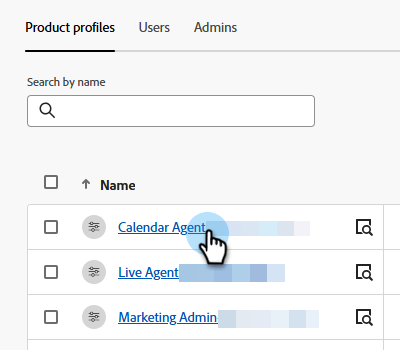

# Enrutando {#routing}

Las reuniones reservadas en Dynamic Chat se pueden organizar de dos maneras. Operación por turnos o uso de una regla personalizada.

Operación por turnos: las reuniones se asignan a los agentes de forma secuencial. Así que si tienes cinco agentes y el agente tres tomó la última reunión, el agente cuatro tendrá la siguiente, seguido por el agente cinco, y luego volverá al agente uno.

Regla personalizada: puede elegir agentes específicos para recibir reuniones en función de los atributos que seleccione.

>[!NOTE]
>
>El enrutamiento de cuentas recibe la prioridad más alta. Cuando un visitante llega al punto de la conversación para reservar una reunión o iniciar una conversación en vivo, [Enrutamiento de cuentas](#account-routing) se comprueba primero antes de considerar otras opciones de enrutamiento.

## Crear una regla personalizada {#create-a-custom-rule}

En este ejemplo, se envían todas las reuniones de los estados deducidos de CA, OR y WA al agente John.

1. En Configuración, haga clic en **Reglas de enrutamiento**.

   

1. La ficha **Reglas personalizadas** se abre de manera predeterminada.

   

1. Haga clic en **Crear regla**.

   

1. Asigne un nombre a la regla Si lo desea, puede agregar una descripción y establecer su nivel de prioridad. Haga clic en **Siguiente**.

   

1. Elija los agentes que desee.

   

1. Arrastre sobre los atributos que desee.

   

1. Busque y seleccione los valores que desee.

   

1. Cuando se hayan seleccionado todos los valores deseados, haga clic en **Guardar**.

   

## Enrutamiento de cuenta {#account-routing}

Identifique y cargue su cuenta de Target y sus respectivos propietarios de ventas, y enrute a los visitantes que provengan de esas cuentas directamente al propietario de la cuenta correspondiente.

>[!PREREQUISITES]
>
>Antes de que _Enrutamiento de cuenta_ sea visible en Dynamic Chat, los permisos deben habilitarse en Admin Console. Consulte [Habilitar permisos](#enable-permissions) a continuación.

### Habilitar permisos {#enable-permissions}

+++ Habilitar permisos de enrutamiento de cuentas

1. Inicie sesión en [https://adminconsole.adobe.com/](https://adminconsole.adobe.com/){target="_blank"}.

1. En _Productos_, seleccione **Dynamic Chat**.

   

1. En _Perfiles de producto_, seleccione el perfil que desee.

   

1. Haga clic en la ficha **Permisos**.

   

1. Haga clic en el icono de edición () junto a _Configuración_.

   

1. Haga clic en el signo **+** junto a _Ver enrutamiento de cuenta_.

   {width="600" zoomable="yes"}

1. Haga clic en **Guardar** cuando termine.

+++

### Agregar una cuenta {#add-an-account}

En este ejemplo, enrutaremos a todos los empleados desde Lego directamente al agente Steven.

1. En la pestaña Enrutamiento de cuenta, haga clic en **+ Agregar cuenta**.

   

   >[!TIP]
   >
   >Puede crear varias cuentas a la vez haciendo clic en **Cargar lista de cuentas** y cargando un archivo CSV.

1. Introduzca el nombre de la empresa, el dominio y seleccione el agente deseado.

   
