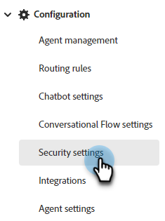

# Configuración de seguridad {#security-settings}

En Configuración de seguridad, puede agregar dominios a una lista de permitidos bloqueada o bloqueada.

## Dominios de correo electrónico bloqueados {#blocked-email-domains}

Si hay visitantes con dominios de correo electrónico con los que no desea que interactúen sus agentes (por ejemplo, un competidor), agregue su dominio de correo electrónico a la lista de bloqueados.

1. Seleccione el regulador **Habilitar validación** para activar la lista de bloqueados. Introduce hasta 50 dominios y haz clic en **Guardar**.

   

## Dominios permitidos {#allowed-domains}

Añadir los dominios permitidos garantiza que terceros no puedan crear secuencias de comandos de JavaScript desde el sitio ni añadirlas a las suyas.

1. Seleccione el regulador **Habilitar validación** para activar la lista de permitidos. Introduce los dominios permitidos y haz clic en **Guardar**.

   
