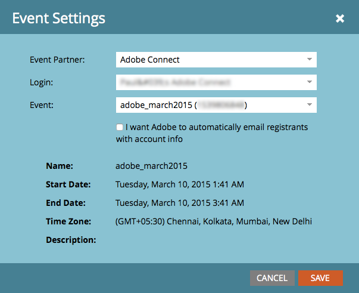

# Crear un evento con Adobe Connect {#create-an-event-with-adobe-connect}

La sincronización con Adobe Connect le permite administrar el registro y la asistencia a seminarios web dentro de Marketo, lo que garantiza que la participación no se quede sin rastrear.

>[!PREREQUISITES]
>
>* [Vincular Adobe Connect y Marketo](/help/marketo/product-docs/administration/additional-integrations/add-adobe-connect-as-a-launchpoint-service.md)
>* [Crear un nuevo programa de eventos](/help/marketo/product-docs/demand-generation/events/understanding-events/create-a-new-event-program.md)

En primer lugar, compruebe que ha creado la reunión o el seminario en Adobe Connect. Si necesita ayuda, consulte la [Guía del usuario de Adobe Connect](https://help.adobe.com/en_US/connect/9.0/using/index.html).

Las reuniones y seminarios que cree en Adobe Connect deben crearse en la carpeta especificada al introducir sus credenciales en Marketo. Después de crear la reunión o el seminario, anote la información logística pertinente (como el número de teléfono) que desee utilizar en el correo electrónico de confirmación y en el archivo ICS.

>[!CAUTION]
>
>Como anfitrión del evento, únase desde la aplicación y **no** mediante el vínculo enviado a los asistentes.

>[!NOTE]
>
>Adobe Connect On-Site no es compatible en este momento.

1. En la página principal de un nuevo evento, selecciona **[!UICONTROL Acciones de evento]** y, a continuación, **[!UICONTROL Configuración de evento]**.

   

   >[!NOTE]
   >
   >Si no ve **[!UICONTROL Configuración de eventos]** en la lista desplegable, compruebe que el canal del evento tenga **[!UICONTROL Evento con seminario web]** seleccionado en &quot;[!UICONTROL Se aplica a]&quot;.

1. En **[!UICONTROL Socio de evento]**, seleccione **[!UICONTROL Adobe Connect]**.

   

1. Seleccione su ID de **[!UICONTROL inicio de sesión]** y luego seleccione su **[!UICONTROL evento]**.

   

1. Haga clic en **[!UICONTROL Guardar]**.

   

   El evento de Adobe Connect ahora se sincroniza con el evento de Marketo.

   >[!NOTE]
   >
   >Los campos que Marketo envía son: Nombre, Apellidos, Dirección de correo electrónico.

   >[!TIP]
   >
   >Para insertar la dirección URL única de la persona en un correo electrónico, use este token: `{{member.webinar url}}`. Cuando se envía el correo electrónico, este token resuelve automáticamente la URL de confirmación única de la persona desde Adobe Connect.
   >
   >Establece tu correo electrónico de confirmación en **Operativo** para asegurarte de que las personas que se registren y puedan darse de baja sigan recibiendo su información de confirmación.

   Las personas que se suscriban a tu seminario web se transferirán a tu proveedor de seminarios web a través del paso de flujo [!UICONTROL Cambiar estado del programa] cuando el [!UICONTROL Nuevo estado] se establezca en &quot;Registrado&quot;. Ningún otro estado empujará a la persona. Además, realice el paso de flujo [!UICONTROL Cambiar estado del programa] #1 y el paso de flujo [!UICONTROL Enviar correo electrónico] #2.

   

   >[!CAUTION]
   >
   >Evite utilizar programas de correo electrónico anidados para enviar los correos electrónicos de confirmación. En su lugar, utilice la campaña inteligente del programa de eventos, como se muestra arriba.

   >[!TIP]
   >
   >Los datos pueden tardar hasta 48 horas en aparecer en Marketo. Si después de tanto tiempo aún no ves nada, selecciona **[!UICONTROL Actualizar del proveedor de seminarios web]** en el menú Acciones de eventos de la pestaña Resumen del evento.

   >[!MORELIKETHIS]
   >
   >* [Agregar Adobe Connect as a [!DNL LaunchPoint] Service](/help/marketo/product-docs/administration/additional-integrations/add-adobe-connect-as-a-launchpoint-service.md)
   >* [Editar un canal de eventos](/help/marketo/product-docs/demand-generation/events/understanding-events/edit-an-event-channel.md)
