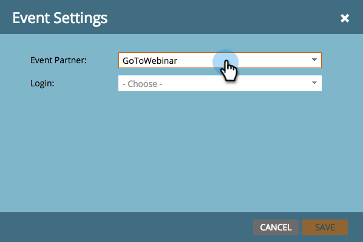

# Crear un evento con el seminario web de Goto {#create-an-event-with-gotowebinar}

>[!PREREQUISITES]
>
>* [Añadir GoToWebinar como servicio de LaunchPoint](/help/marketo/product-docs/administration/additional-integrations/add-gotowebinar-as-a-launchpoint-service.md)
* [Crear un nuevo programa de eventos](/help/marketo/product-docs/demand-generation/events/understanding-events/create-a-new-event-program.md)
* Configure las [acciones de flujo](/help/marketo/product-docs/core-marketo-concepts/smart-campaigns/flow-actions/add-a-flow-step-to-a-smart-campaign.md)adecuadas para rastrear la participación

Primero cree su seminario web en GoToWebinar. Marketo utiliza ciertos ajustes en la creación del seminario web de GoToWebinar y algunos solo los usa GoToWebinar.

Después de crear un evento de Marketo y asociar el GoToWebinar con él, los sistemas podrán compartir información de registro y asistencia.

A continuación se muestra una lista de los ajustes utilizados por Marketo.

## Título y descripción {#title-and-description}

**Nombre del seminario web** : introduzca el nombre del seminario web. Este nombre se puede ver en Marketo.

**Descripción**  (opcional): introduzca la descripción del seminario web. La descripción se puede ver en Marketo.

## Fecha y hora {#date-time}

Introduzca la siguiente información para su seminario web y se extraerá en Marketo a través del adaptador. Si realiza cambios en esta información, debe hacer clic en el enlace &quot;**Actualizar desde el proveedor de seminarios web**&quot; en **Acciones de evento**, para que Marketo pueda ver los cambios.

**Fecha de inicio** : introduzca la fecha de inicio. Esto se puede ver en Marketo.

**Hora de inicio** : introduzca la hora de inicio. Esto se puede ver en Marketo.

**Hora de finalización** : introduzca la hora de finalización. Esto se puede ver en Marketo.

**Zona horaria** : seleccione la zona horaria correspondiente. Se puede ver en Marketo.

**Tipo:** se establece en  **Una sesión**.

>[!NOTE]
Actualmente, Marketo no admite seminarios web recurrentes. Debe configurar una sola sesión entre cada Evento de Marketo y el seminario web de GoToWebinar.

>[!TIP]
Si necesita ayuda adicional de GoToWebinar, visite su [Sitio de ayuda](https://support.logmeininc.com/gotowebinar).

¡Ahora vamos a entrar en Marketo!

1. Seleccione un evento. Haga clic en **Acciones de evento** y elija **Configuración de evento**.

   

   >[!NOTE]
   El tipo de canal del evento seleccionado debe ser **webinar**.

1. Elija **GoToWebinar** en la lista **Socio de evento**.

   

1. Elija la cuenta.

   

1. Seleccione el seminario web.

   

1. Haga clic en **Guardar**.

   

1. ¡Excelente! Ahora el evento está sincronizado y programado por **GoToWebinar**.

   

   >[!NOTE]
   Los campos que Marketo envía son: Nombre, Apellido, Dirección De Correo Electrónico. Estos campos son obligatorios y no deben estar vacíos.

   >[!TIP]
   Para rellenar el correo electrónico de confirmación con esta dirección URL única, utilice el token siguiente en el correo electrónico: `{{member.webinar url}}`. Cuando se envía la dirección URL de confirmación, este token se resuelve automáticamente en la dirección URL de confirmación única de la persona.
   Configure el correo electrónico de confirmación en **Operativo** para asegurarse de que las personas que se registren y puedan darse de baja reciban la información de confirmación.

   

   >[!CAUTION]
   Evite utilizar programas de correo electrónico anidados para enviar los correos electrónicos de confirmación. En su lugar, utilice la campaña inteligente del programa de eventos, como se muestra arriba.

   >[!TIP]
   Los datos pueden tardar hasta 48 horas en aparecer en Marketo. Si después de esperar tanto tiempo aún no ve nada, seleccione **Actualizar desde el proveedor de seminarios web** en el menú Acciones de evento de la pestaña **Resumen** del evento.

Las personas que se registren en el seminario web se enviarán al proveedor de seminarios web a través del paso Cambiar el estado del programa cuando el nuevo estado esté configurado como &quot;Registrado&quot;. Ningún otro estado empuja a la persona. Además, asegúrese de realizar el paso 1 del flujo de cambio de estado del programa y el paso 2 del flujo de envío de correo electrónico.

## Visualización del programa  {#viewing-the-schedule}

En la vista de programación del programa, haga clic en la entrada de calendario del evento. Puede ver la programación en el lado derecho de la pantalla.

>[!NOTE]
Para cambiar la programación de eventos, deberá editar el seminario web en el seminario web de GoToWebinar.

