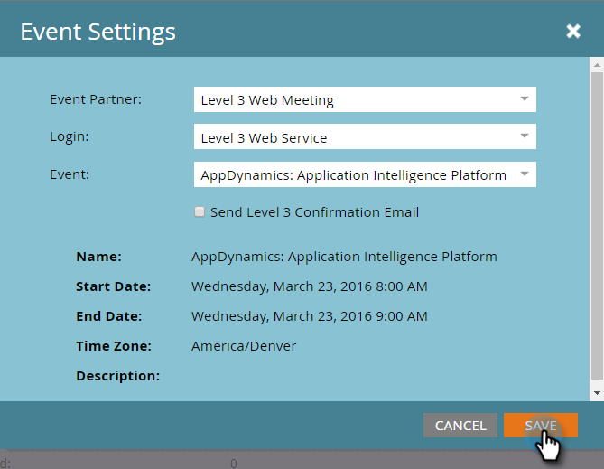

# Crear un evento con reunión web de nivel 3 {#create-an-event-with-level-web-meeting}

>[!PREREQUISITES]
>
>* [Agregar reunión Web de nivel 3 como servicio de LaunchPoint](/help/marketo/product-docs/administration/additional-integrations/add-level-3-web-meeting-as-a-launchpoint-service.md)
>* [Crear un nuevo programa de eventos](/help/marketo/product-docs/demand-generation/events/understanding-events/create-a-new-event-program.md)
>* Configure las variables apropiadas [acciones de flujo](/help/marketo/product-docs/core-marketo-concepts/smart-campaigns/flow-actions/add-a-flow-step-to-a-smart-campaign.md)para rastrear la participación

Cree primero su seminario web en el nivel 3. Si necesita ayuda, consulte la [Biblioteca de recursos de nivel 3](https://www.level3.com/en/resource-library/). Verá que es muy similar a BrightTalk.  Marketo utiliza un pequeño subconjunto de campos de Nivel 3:

* **Nombre** - El nombre del webcast.
* **Fecha de inicio** - La fecha de inicio del webcast.
* **Fecha de finalización** - La fecha de finalización del webcast.
* **Zona horaria** - La zona horaria establecida para la transmisión web.
* **Descripción** - La descripción del webcast.

1. Seleccione el nuevo evento. Clic **Acciones de evento,** entonces **Configuración de eventos.**

   

1. En Socio de evento, seleccione **Reunión web del nivel 3**.

   

1. En Inicio de sesión, seleccione su inicio de sesión de nivel 3.

   

1. En Evento, elija el evento de Nivel 3 que desee utilizar.

   

1. Clic **Guardar**.

   

   ¡Excelente! ¡Has conectado tu evento al Nivel 3!

## Visualización de la programación  {#viewing-the-schedule}

En la vista de programación, haga clic en la entrada de calendario del evento. Puede ver la programación en la parte derecha de la pantalla.

