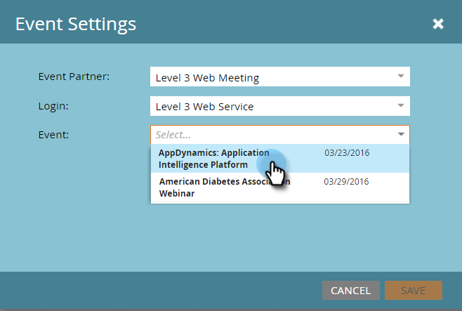

# Crear un evento con [!DNL Level 3 Web Meeting] {#create-an-event-with-level-web-meeting}

>[!PREREQUISITES]
>
>* [Agregar [!DNL Level 3 Web Meeting] como [!DNL LaunchPoint] servicio](/help/marketo/product-docs/administration/additional-integrations/add-level-3-web-meeting-as-a-launchpoint-service.md)
>* [Crear un nuevo programa de eventos](/help/marketo/product-docs/demand-generation/events/understanding-events/create-a-new-event-program.md)
>* Establezca las [acciones de flujo](/help/marketo/product-docs/core-marketo-concepts/smart-campaigns/flow-actions/add-a-flow-step-to-a-smart-campaign.md)adecuadas para rastrear la participación

Primero cree su seminario web en [!DNL Level 3]. Si necesita ayuda, consulte la [[!DNL Level 3] Biblioteca de recursos](https://www.level3.com/en/resource-library/). Es muy similar a [!DNL BrightTalk].  Marketo usa un pequeño subconjunto de [!DNL Level 3] campos:

* **Nombre** - El nombre de la difusión web.
* **Fecha de inicio** - La fecha de inicio de la difusión web.
* **Fecha de finalización** - La fecha de finalización de la difusión web.
* **Zona horaria**: La zona horaria establecida para la transmisión web.
* **Descripción** - La descripción de la difusión web.

1. Seleccione el nuevo evento. Haga clic en **[!UICONTROL Acciones de eventos],** y, a continuación, en **[!UICONTROL Configuración de eventos].**

   

1. En [!UICONTROL Socio del evento], seleccione **[!UICONTROL Reunión web de nivel 3]**.

   

1. En [!UICONTROL Iniciar sesión], seleccione su inicio de sesión de [!DNL Level 3].

   

1. En [!UICONTROL Evento], elija el evento [!DNL Level 3] que desee usar.

   

1. Haga clic en **[!UICONTROL Guardar]**.

   

   El evento ahora está conectado a [!DNL Level 3].

## Visualización de la programación  {#viewing-the-schedule}

En la vista de programación, haga clic en la entrada de calendario del evento. Puede ver la programación en la parte derecha de la pantalla.

