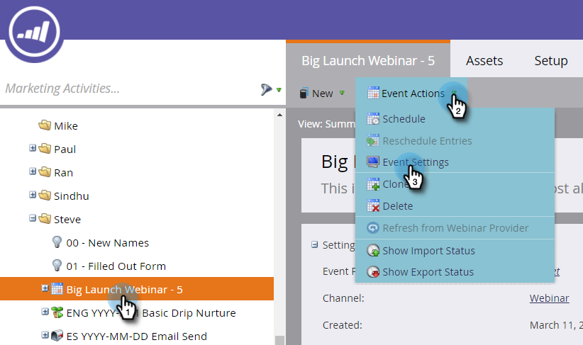
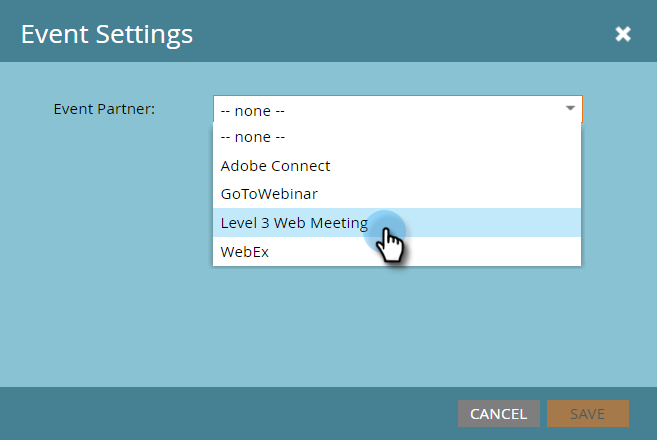

# Crear un Evento con una reunión web de nivel 3 {#create-an-event-with-level-web-meeting}

>[!PREREQUISITES]
>
>* [Añadir una reunión web de nivel 3 como servicio de LaunchPoint](/help/marketo/product-docs/administration/additional-integrations/add-level-3-web-meeting-as-a-launchpoint-service.md)
>* [Crear un nuevo Programa de Evento](/help/marketo/product-docs/demand-generation/events/understanding-events/create-a-new-event-program.md)
>* Configure las acciones de [flujo adecuadas para](https://docs.marketo.com/x/k8Kt)realizar el seguimiento de la participación

>

Primero cree su seminario web en el nivel 3. Si necesita ayuda, consulte la biblioteca [de recursos de](http://www.level3.com/en/resource-library/)nivel 3. Encontrarás que es muy similar a BrightTalk.  Marketo utiliza un pequeño subconjunto de campos de Nivel 3:

* **Nombre** : el nombre del webcast.
* **Fecha** de inicio: fecha de inicio del webcast.
* **Fecha** de finalización: fecha de finalización del webcast.
* **Huso horario** : el huso horario establecido para el webcast.
* **Descripción** : la descripción del webcast.

1. Seleccione su nuevo evento. Haga clic en Acciones de **Evento,** luego en Configuración de **Evento.**

   

1. En Socio de Evento, seleccione Reunión **Web de** nivel 3.

   

1. En Inicio de sesión, seleccione su inicio de sesión de Nivel 3.

   

1. En Evento, elija el evento de nivel 3 que desee utilizar.

   

1. Haga clic en **Guardar**.

   

   ¡Muy excelente! ¡Has conectado tu evento al nivel 3!

## Visualización de la programación  {#viewing-the-schedule}

En la vista [de](http://docs.marketo.com/display/docs/program+schedule+view)calandario del programa, haga clic en la entrada de calendario del evento. Puedes ver la programación en el lado derecho de la pantalla!

