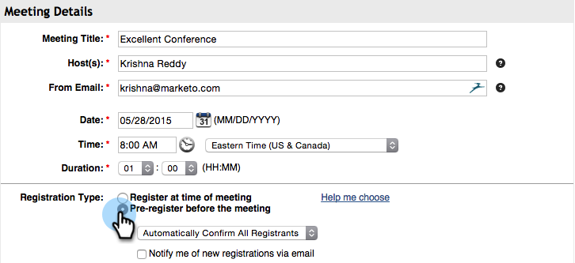

# Crear un Evento con ReadyTalk {#create-an-event-with-readytalk}

>[!PREREQUISITES]
>
>* [Añadir ReadyTalk como un servicio de LaunchPoint](/help/marketo/product-docs/administration/additional-integrations/add-readytalk-as-a-launchpoint-service.md)
>* [Crear un nuevo Programa de Evento](/help/marketo/product-docs/demand-generation/events/understanding-events/create-a-new-event-program.md)
>* Configure las acciones de [flujo adecuadas para](http://docs.marketo.com/display/DOCS/Flow+Actions)realizar el seguimiento de la participación

Primero configure su evento en el centro de conferencias ReadyTalk. Si necesita ayuda, consulte el Centro de recursos [ReadyTalk.](https://www.readytalk.com/resources/readytalk)  Al elegir el tipo de registro, seleccione **preinscribirse antes de la reunión**. Si selecciona *registrarse en el momento de la reunión*, Marketing **no capturará** un estado de registro para su gente y solo obtendrá un estado de persona de Asistencia *después* de que finalice el seminario web.

Dejarme **notificarme de nuevos registros por correo electrónico** sin marcar.

Si utiliza ReadyTalk para enviar correos electrónicos de confirmación, también deberá agregar una descripción. Guarde su evento en ReadyTalk cuando haya terminado.

>[!NOTE]
>
>Para programar un Evento asistido por un operador, haga clic en el vínculo **Solicitar servicios** de Evento ubicado en la parte izquierda de la pantalla de inicio del Centro de conferencias para programar un evento con nuestro equipo de Eventos.

Ahora está listo para vincular su evento a Marketing.

1. Seleccione el evento, haga clic en Acciones **de** Evento y, finalmente, en Configuración de **Evento.**

   

   >[!NOTE]
   >
   >El tipo de canal del evento seleccionado debe ser **seminario web.**

1. En **Evento Partner,** seleccione **ReadyTalk**.

   

1. En **Inicio de sesión,** seleccione el inicio de sesión de ReadyTalk.

   

1. En **Evento**, seleccione el evento que desea vincular y haga clic en **Guardar**.

   

   ¡Bonito! El evento se ha sincronizado.

   >[!NOTE]
   >
   >Los campos que envía Marketing to son: Nombre, Apellido, Dirección De Correo Electrónico.

   >[!TIP]
   >
   >Para completar el correo electrónico de confirmación con esta dirección URL única, utilice el siguiente token en el correo electrónico: `{{member.webinar url}}`. Cuando se envía la dirección URL de confirmación, este token se resuelve automáticamente en la dirección URL de confirmación única de la persona.
   >
   >Establezca su correo electrónico de confirmación en Operativo para asegurarse de que las personas que se registren, que podrían quedar sin suscripción, reciban su información de confirmación.

   

   >[!CAUTION]
   >
   >Evite utilizar programas de correo electrónico anidados para enviar sus correos electrónicos de confirmación. Utilice la campaña inteligente del programa de evento en su lugar, como se muestra arriba.

   >[!TIP]
   >
   >Los datos pueden tardar hasta 48 horas en aparecer en Marketing. Si después de esperar tanto tiempo aún no ve nada, seleccione **Actualizar desde el proveedor** de seminario web en el menú Acciones de Evento de la ficha **Resumen** de su evento.

## Visualización de la programación  {#viewing-the-schedule}

En la vista [de](http://docs.marketo.com/display/docs/program+schedule+view)calandario del programa, haga clic en la entrada de calendario del evento. Puedes ver la programación en el lado derecho de la pantalla!

Las personas que se registren en el seminario web se enviarán a su proveedor de seminarios web a través del paso Cambiar el estado del Programa cuando el estado nuevo se establezca en &quot;Registrado&quot;. Ningún otro estado empujará a la persona. Además, asegúrese de que el paso 1 del flujo de cambio de estado de Programa y el paso 2 del flujo de envío de correo electrónico.
