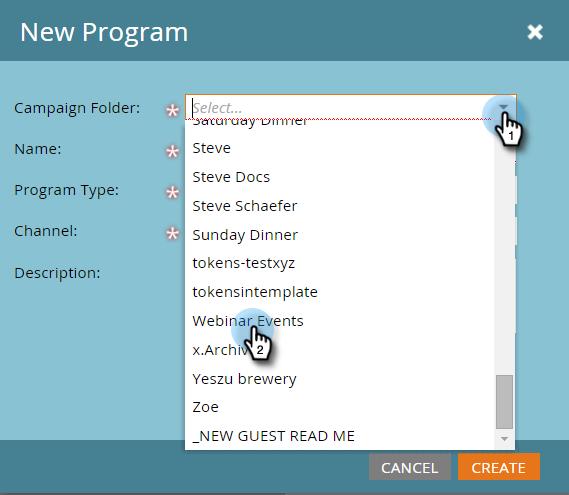

# Ejemplo de integración de eventos ON24 {#example-on-event-integration}

Este es un evento de ejemplo, incluidas las campañas, para un seminario web ON24. Cuando cree su evento, asegúrese de probar las campañas antes de ejecutarlas.

## Crear un evento nuevo en actividades de marketing {#create-a-new-event-in-marketing-activities}

1. Seleccione **[!UICONTROL Nuevo]** > **[!UICONTROL Nuevo Programa]**.

   

1. Seleccione una **[!UICONTROL carpeta de campañas]** en la que se activará el evento.

   

1. Escriba un **[!UICONTROL Nombre]** para el evento.

   

1. Seleccione **[!UICONTROL Evento]** como **[!UICONTROL Tipo de programa]**.

   

1. Seleccione **[!UICONTROL Seminario web]** como **[!UICONTROL Canal]** para el evento.

   

1. Haga clic en **[!UICONTROL Crear]**.

   

## Invitar (campaña por lotes)  {#invite-batch-campaign}

* **Lista inteligente** - Define a quién invitarás al evento.
* **Flujo**

   * Enviar correo electrónico: si se trata de un correo electrónico de recurso local, tendrá la siguiente convención de nomenclatura: EventName.EmailName. También puede utilizar correos electrónicos globales.
   * Cambiar estado en progresión: establezca en Seminario web > Invitado.

* **Programación** - Establezca la fecha para enviar la invitación.

## Registro/Confirmación (Campaña de Déclencheur) {#registration-confirmation-trigger-campaign}

* **Lista inteligente**

   * Almacene en déclencheur la campaña según **[!UICONTROL Rellena el formulario]**. Asegúrese de incluir la página de aterrizaje en la que se encuentra el formulario mediante **[!UICONTROL Agregar restricción]**, especialmente si el formulario se utiliza en varias páginas de aterrizaje.

>[!CAUTION]
>
>Debe utilizar un formulario de Marketo para registrar a las personas en el evento o un formulario que no sea de Marketo con la integración de API adecuada para insertar los datos de registro en Marketo. Esto es fundamental para el éxito de su integración de [!UICONTROL Event Partner]. **NOTA**: Si está usando un formulario de Marketo en una página de aterrizaje que no sea de Marketo, su déclencheur será **[!UICONTROL Rellena el formulario]** con el [!UICONTROL Nombre del formulario].

* **Flujo**

   * **Cambiar estado en progresión** - Definir en Seminario web > Registrado. **PRECAUCIÓN**: Este paso de flujo es necesario al configurar su campaña secundaria. Cuando el estado de progresión de una persona cambia a **Registrada**, Marketo envía la información de registro a ON24.

   * **Enviar correo electrónico** - Correo electrónico de confirmación (configurado en **Operativo** para que las personas que cancelaron la suscripción y que se han registrado lo reciban).

**NOTA**: Si la persona vuelve con un error de registro, no recibirá la confirmación por correo electrónico.

## Recordatorio (campaña por lotes) {#reminder-batch-campaign}

* **Lista inteligente** - Filtre con **Miembro del programa** y establezca el estado en **Registrado**.

* **Flujo** - Enviar correo electrónico (Correo electrónico de recordatorio).

**NOTA**: podrías usar una campaña similar para enviar un correo electrónico de seguimiento de *diferentes* a las personas invitadas pero que aún no se han registrado.

## Campaña de seguimiento (campaña por lotes o de Déclencheur) {#follow-up-campaign-batch-or-trigger-campaign}

* **Lista inteligente**: Déclencheur basado en los cambios en el estado del programa.

* **Flujo** - Enviar correo electrónico. Utilice opciones para enviar diferentes correos electrónicos en función del estado del programa.

>[!MORELIKETHIS]
>
>[Explicación de los eventos del adaptador Marketo ON24](/help/marketo/product-docs/demand-generation/events/create-an-event/create-an-event-with-the-marketo-on24-adapter/understanding-marketo-on24-adapter-events.md){target="_blank"}
