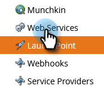

# Configuración de la integración ON24 con Marketo{#set-up-the-on24-integration-with-marketo}

A continuación se muestra cómo configurar la integración de eventos ON24.

## Crear una función solo de API {#create-an-api-only-role}

1. En Mi Marketo, haga clic en **Administrador**.

   

1. En Seguridad, haga clic en **Usuarios y funciones**.

   

1. Haga clic en el **Funciones** pestaña y luego **Nueva función**.

   

1. Introduzca un nombre de rol. Abra el **Acceso a la API** y seleccione &quot;Read-Write Custom Object&quot; y &quot;Read-Write Person&quot;. Haga clic en **Crear**.

   

## Crear un nuevo usuario {#create-a-new-user}

1. En Usuarios y funciones, haga clic en el botón **Usuarios** y haga clic en **Invitar a nuevo usuario**.

   

1. Introduzca la información del nuevo usuario y haga clic en **Siguiente**.

   

1. Seleccione la función Solo API ON24 que acaba de crear. Seleccione el **Solo API** casilla de verificación. Haga clic en **Siguiente**.

   

1. Haga clic en **Enviar**.

   

>[!NOTE]
>
>No se requiere una invitación para los usuarios solo de API.

## Configuración de la conexión ON24 {#set-up-on24-connection}

1. En la sección Administración , haga clic en **LaunchPoint**.

   

1. Haga clic en **Nuevo** then **Nuevo servicio**.

   

1. Elija un nombre para mostrar. Haga clic en el **Servicio** y seleccione **Personalizado**. Introduzca una descripción. Haga clic en la lista desplegable Solo usuario de API y seleccione el usuario que ha creado [en los pasos anteriores](#create-a-new-user). Haga clic en **Crear**.

   

1. Busque el servicio personalizado de LaunchPoint que acaba de crear y haga clic en Ver detalles.

   

1. Resalte, haga clic con el botón derecho, copie y guarde el ID de cliente (lo necesitará más adelante). Repita el proceso para el Secreto del cliente.

   

1. En el árbol de la izquierda, haga clic en Servicios Web.

   

1. En &quot;API de REST&quot;, resalte, haga clic con el botón derecho, copie y guarde la primera parte de la identidad (hasta la &quot;m&quot; en .com).

   

1. Con su ID de cliente, secreto de cliente e identidad guardados, vaya a su cuenta de ON24. El resto de los pasos se realizan allí y son [descritos aquí](https://on24support.force.com/Support/s/article/Connect-Marketo-ON24-Connect-Data-Integration#Step6){target=&quot;_blank&quot;}.
