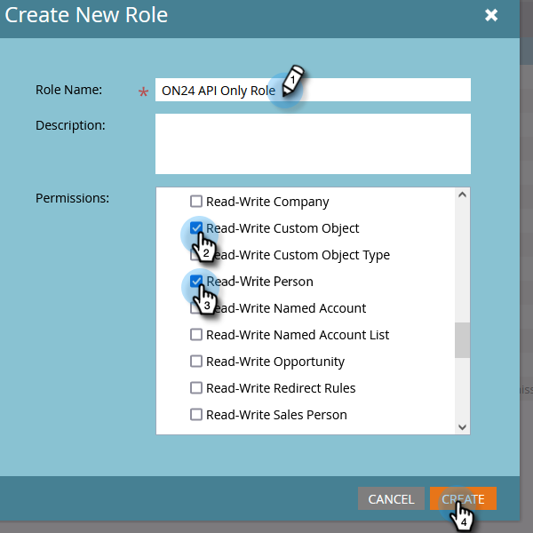

# Configuración de la integración ON24 con Marketo{#set-up-the-on24-integration-with-marketo}

A continuación se muestra cómo configurar la integración de eventos ON24.

## Crear una función solo de API {#create-an-api-only-role}

1. En Mi Marketo, haga clic en **[!UICONTROL Administrador]**.

   

1. En [!UICONTROL Seguridad], haga clic en **[!UICONTROL Usuarios y roles]**.

   

1. Haga clic en la ficha **[!UICONTROL Roles]** y luego en **[!UICONTROL Nuevo rol]**.

   

1. Escriba un [!UICONTROL Nombre de rol]. Abra el menú **[!UICONTROL API de acceso]** y seleccione &quot;[!UICONTROL Objeto personalizado de lectura-escritura]&quot; y &quot;[!UICONTROL Persona de lectura-escritura]&quot;.&quot; Haga clic en **[!UICONTROL Crear]**.

   

## Crear un nuevo usuario {#create-a-new-user}

1. Aún en [!UICONTROL Usuarios y roles], haga clic en la ficha **[!UICONTROL Usuarios]** y luego en **[!UICONTROL Invitar nuevo usuario]**.

   

1. Escriba la información del nuevo usuario y haga clic en **[!UICONTROL Siguiente]**.

   

1. Seleccione el [!UICONTROL Rol exclusivo de API ON24 (todos los espacios de trabajo)] que acaba de crear. Seleccione la casilla **[!UICONTROL Solo API]**. Haga clic en **[!UICONTROL Siguiente]**.

   

1. Haga clic en **[!UICONTROL Enviar]**.

   

>[!NOTE]
>
>No se requiere una invitación para los usuarios solo de API.

## Configuración de la conexión ON24 {#set-up-on24-connection}

1. En la sección [!UICONTROL Admin], haga clic en **[!UICONTROL LaunchPoint]**.

   

1. Haga clic en **[!UICONTROL Nuevo]** y luego en **[!UICONTROL Nuevo servicio]**.

   

1. Elija [!UICONTROL nombre para mostrar]. Haga clic en el menú desplegable **[!UICONTROL Servicio]** y seleccione **[!UICONTROL Personalizado]**. Escriba una [!UICONTROL descripción]. Haga clic en el menú desplegable [!UICONTROL Usuario solo de API] y seleccione el usuario que creó [en los pasos anteriores](#create-a-new-user). Haga clic en **[!UICONTROL Crear]**.

   

1. Busque el servicio personalizado [!DNL LaunchPoint] que acaba de crear y haga clic en [!UICONTROL Ver detalles].

   

1. Resalte, haga clic con el botón derecho, copie y guarde el [!UICONTROL ID de cliente] (lo necesitará más adelante). Repita el proceso para [!UICONTROL Secreto del cliente].

   

1. En el árbol de la izquierda, haga clic en **[!UICONTROL Servicios Web]**.

   

1. En &quot;[!UICONTROL API de REST]&quot;, resalte, haga clic con el botón derecho, copie y guarde la primera parte de la [!UICONTROL identidad] (hasta la &#39;m&#39; en .com).

   

1. Con el ID de cliente, el secreto de cliente y la identidad guardados, vaya a la cuenta ON24. El resto de los pasos se realizan allí y se pueden encontrar en la [documentación de ON24](https://support.on24.com/hc/en-us/articles/21420762650523-Data-Integration-Setup-Instructions-When-Using-Marketo-Registration-Option-1){target="_blank"}.
