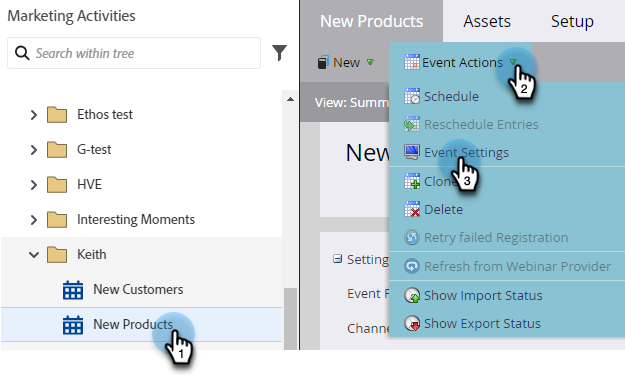
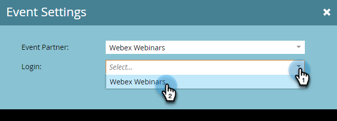

# Creación de un evento con Webex {#create-an-event-with-webex}

Después de crear un seminario web en Webex, deberá sincronizar el evento con Marketo Engage.

>[!PREREQUISITES]
>
>* [Añadir Webex como servicio de LaunchPoint](/help/marketo/product-docs/administration/additional-integrations/add-webex-as-a-launchpoint-service.md)
>* [Crear un nuevo programa de eventos](/help/marketo/product-docs/demand-generation/events/understanding-events/create-a-new-event-program.md)
>* Configure las variables apropiadas [acciones de flujo](/help/marketo/product-docs/core-marketo-concepts/smart-campaigns/flow-actions/add-a-flow-step-to-a-smart-campaign.md) para rastrear la participación

## Programar el seminario web {#schedule-your-webinar}

Programas tu evento y eliges tu configuración preferida en [Webex](https://www.webex.com/){target="_blank"}. Only the following information is viewable in Marketo: webinar name, start/end date & time, time zone, and description. Additional information about Webex Webinars [can be found here](https://help.webex.com/en-us/landing/ld-7srxjs-WebexWebinars/Webex-Webinars){target="_blank"}.

### Información básica {#basic-information}

* **Tema**: este es el nombre del evento y se podrá ver en Marketo.
* **Fecha y hora**: la fecha de inicio/finalización, la hora de inicio/finalización, la duración y la zona horaria se pueden ver en Marketo.
* **Máximo de asistentes**: El número máximo de asistentes determina qué funciones Webex son compatibles.
* **Vista de webcast para asistentes**: Marque esta opción para que su seminario web se transmita en directo a todos los asistentes.
* **Panelistas**: invite a personas específicas a ser panelistas en el seminario web.
* **Agenda del seminario web**: rellene esta opción si desea proporcionar contexto en la invitación por correo electrónico que se envía a los integrantes del panel.

### Seguridad {#security}

* **Contraseña del seminario web**: (opcional) Si utiliza este campo, asegúrese de incluirlo en el correo electrónico de confirmación.
* **Contraseña de panelista**: (opcional) Si utiliza este campo, asegúrese de incluirlo en la agenda del seminario web.
* **Requerir cuenta**: Limita los asistentes solo a aquellos que tienen cuentas de Webex.

### Opciones de conexión de audio {#audio-connection-options}

* **Tipo de conexión de audio**: elija cómo los participantes del seminario web se unen a la parte de audio del seminario web.
* **Tono de entrada y salida**: seleccione el sonido que desea que tengan los usuarios cuando alguien entre o salga del seminario web (se requiere conexión de audio telefónica).
* **Silenciar panelista**: elija la configuración de silencio de la lista del panel que desee.

### Opciones avanzadas {#advanced-options}

* **Grabación automática**: Marque esta opción para que el seminario web se registre automáticamente.
* **Sesión de práctica**: marque esta opción para que se inicie una sesión de práctica cuando comience el seminario web.
* **Sesiones de desglose**: las sesiones de desglose le permiten preasignar panelistas y asistentes antes de que comience el seminario web o permitirles unirse durante este.
* **Serie de seminarios web**: añadir a una serie de seminarios web permite a las personas ver el seminario web si es público o no.
* **Registro**: requiere que los asistentes se registren y reciban la aprobación del anfitrión antes de asistir.
* **Recordatorio por correo electrónico**: elija un recordatorio por correo electrónico de un máximo de 15 minutos antes de que el seminario web se inicie y hasta dos días.
* **Opciones del seminario web**: determine qué funciones están disponibles para los participantes en el seminario web.
* **Privilegios de participante**: Los privilegios de participante determinan las acciones disponibles para los participantes en el seminario web.

>[!NOTE]
>
>La integración Marketo-Webex no puede admitir el envío de correos electrónicos de confirmación desde Webex. La confirmación debe enviarse a través de Marketo. Una vez programado el evento, asegúrese de copiar la información del evento en el correo electrónico de confirmación de Marketo y establecer el correo electrónico como _Operativo_.

## Sincronizar el evento con el Marketo Engage {#sync-your-event-with-marketo-engage}

1. En Marketo, busque y seleccione el programa de eventos deseado. En el **Acciones de evento** menú desplegable, seleccione **Configuración de eventos**.

   

   >[!NOTE]
   >
   >El tipo de canal del evento seleccionado debe ser **seminario web**.

1. En el **Socio de evento** menú desplegable, seleccione **Webinars de Webex**.

   

1. En el **Iniciar sesión** , elija su inicio de sesión en Webex.

   

1. En el **Evento** , elija su evento de Webex.

   

1. Se rellenarán los detalles del seminario web. Haga clic en **Guardar**.

   

El evento de Webex ahora se sincroniza con el programa de eventos de Marketo. Las personas que se suscriban a su seminario web se enviarán al proveedor del seminario web a través del _Cambiar estado del programa_ paso de flujo cuando el nuevo estado se establece en &quot;Registrado&quot;. Ningún otro estado empujará a la persona. Asegúrese de hacer lo siguiente _Cambiar estado del programa_ paso de flujo #1, y _Enviar correo electrónico_ paso de flujo #2.

## Cosas que hay que tener en cuenta {#things-to-note}

* Evite utilizar programas de correo electrónico anidados para enviar los correos electrónicos de confirmación. En su lugar, utilice la campaña inteligente del programa de eventos.

* Los datos pueden tardar hasta 48 horas en aparecer en Marketo. Si después de tanto tiempo sigue sin ver nada, haga clic en **Actualizar del proveedor de seminarios web** en el **Acciones de evento** menú desplegable en el **Resumen** de su programa de eventos.
