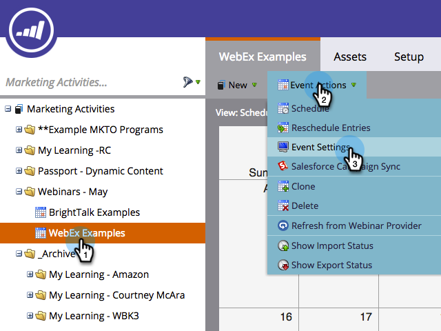
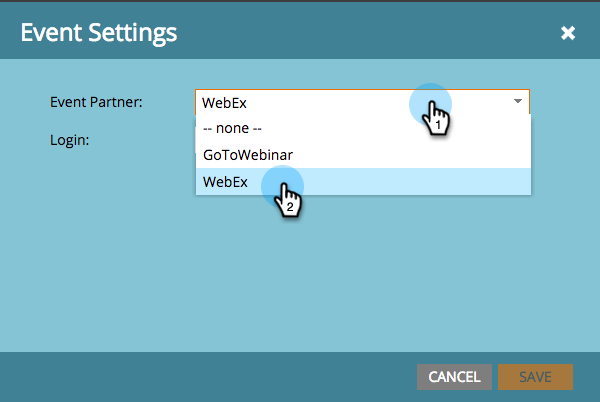

# Crear un evento con WebEx {#create-an-event-with-webex}

>[!PREREQUISITES]
>
>* [Añadir WebEx como servicio de LaunchPoint](/help/marketo/product-docs/administration/additional-integrations/add-webex-as-a-launchpoint-service.md)
>* [Crear un nuevo programa de eventos](/help/marketo/product-docs/demand-generation/events/understanding-events/create-a-new-event-program.md)
>* Configure los correspondientes [acciones de flujo](/help/marketo/product-docs/core-marketo-concepts/smart-campaigns/flow-actions/add-a-flow-step-to-a-smart-campaign.md) para realizar un seguimiento de la participación
>* Asegúrese de que está utilizando eventos Webex (clásica)

Primero cree un evento Webex en el Centro de eventos WebEx. Marketo solo utiliza la configuración y los campos específicos para su integración, que se completarán próximamente. Otros campos que puede que desee configurar para WebEx se explican en la sección [Guía del usuario del Centro de Eventos WebEx](https://www.cisco.com/c/dam/en/us/td/docs/collaboration/meeting_center/wbs298/wx_ec_host_ug.pdf).

>[!IMPORTANT]
>
>Marketo Engage solo admite eventos creados en eventos Webex (Classic). Marketo no admite eventos creados en eventos de Webex (nuevos) en este momento.

## Información básica {#basic-information}

* **Nombre del evento -** Este nombre se puede ver en Marketo.
* **Casilla de verificación no enumerada**

   * Se recomienda que lo haga **not** enumere el evento. Esto garantizará que todas las personas se registren a través de su página de aterrizaje de Marketo. Las personas que se registren mediante un mecanismo distinto de Marketo se mostrarán en Marketo una vez finalizado el evento Y solo si asistieron al mismo.
   * Si elige enumerar el evento, este aparecerá en la página Lista de eventos para cualquier persona que visite el sitio web del Centro de eventos.

* **Registro -** Marque esta casilla para establecer en &quot;requerido&quot;. Utilizará un formulario o una página de aterrizaje de Marketo para capturar la información de registro que se insertará en WebEx.
* **Contraseña del evento**- (opcional) Si utiliza este campo, asegúrese de incluirlo en su correo electrónico de confirmación.

## Fecha y hora {#date-time}

* **Fecha de inicio** - Introduzca la fecha de inicio. Esto se puede ver en Marketo.

* **Hora de inicio** - Introduzca la hora de inicio. Esto se puede ver en Marketo.

* **Duración estimada** - Especifique la duración del evento. Esto se puede ver en Marketo.

* **Zonas horarias** - Introduzca las zonas horarias aplicables. Se pueden ver en Marketo.

## Configuración de conferencia de audio {#audio-conference-settings}

Estos ajustes solo residen en WebEx. No son utilizados por ni se pueden ver en Marketo, pero puede que sean importantes para su seminario web, por lo que debe comprobarlos dos veces.

## Descripción y opciones del evento  {#event-description-options}

Marketo utiliza o puede ver las siguientes opciones. Otros campos solo residen en WebEx.

* **Descripción** - Introduzca una descripción. Esto se puede ver, pero no se puede modificar en Marketo.
* **Encuesta posterior al evento** - Marketo no puede capturar la información en una encuesta posterior al evento de WebEx en este momento.
* **Dirección URL de destino** : (opcional) puede introducir la dirección URL de una página de aterrizaje de Marketo para que sirva como dirección URL de destino que se mostrará una vez finalizada la sesión.

## Asistentes y registro {#attendees-registration}

Controlará la lista de invitación, el formulario de registro y otros correos electrónicos mediante un Evento de Marketo. Marketo no admitirá otras funciones, entre ellas:

* **Número máximo de solicitantes de registro** - Actualmente **not** compatible con la integración Marketo-WebEx.  La aprobación manual de los registradores está disponible utilizando el estado Pendiente de aprobación de progresión en Marketo.

* **Se requiere un ID de registro** - Actualmente compatible con la integración Marketo-WebEx. Puede utilizar Marketo para enviar el correo electrónico de confirmación del evento. Cuando la persona se registra, recibe una dirección URL única que utiliza para entrar en el evento.

   >[!TIP]
   >
   >Para rellenar el correo electrónico de confirmación con esta dirección URL única, utilice el token siguiente en el correo electrónico: `{{member.webinar url}}`. Cuando se envía la dirección URL de confirmación, este token se resuelve automáticamente en la dirección URL de confirmación única de la persona.
   >
   >Configure el correo electrónico de confirmación en **Operativo** para garantizar que las personas que se registren y puedan darse de baja sigan recibiendo su información de confirmación.

* **Contraseña de registro** : (Opcional) Actualmente no se admite mediante la integración Marketo-WebEx.
* **Reglas de aprobación** - Actualmente no es compatible con la integración Marketo-WebEx. Sin embargo, puede utilizar campañas inteligentes en Marketo para controlar las aprobaciones.

### Presentadores y ponentes {#presenters-panelists}

La información configurada en esta sección no se pasa a Marketo.

### Mensajes de correo electrónico {#email-messages}

Utilizará Marketo para enviar correos electrónicos a sus usuarios registrados, correos electrónicos de confirmación, etc. No es necesario configurar nada en esta sección. Desactive (desmarque) las opciones de mensajes de correo electrónico en WebEx.

>[!NOTE]
>
>La integración Marketo-WebEx no admite el envío de correos electrónicos de confirmación desde WebEx. La confirmación se debe enviar mediante Marketo. Una vez programado el evento, asegúrese de copiar la información del evento en el correo electrónico de confirmación de Marketo y establecer el correo electrónico como **Operativo**.

¡Ahora estamos listos para entrar en Marketo!

1. Seleccione el evento que ha creado. Abra el **Acciones de evento** lista desplegable. Choose **Configuración de eventos.**

   

   >[!NOTE]
   >
   >El tipo de canal del evento seleccionado debe ser **seminario web**.

1. En **Socio de evento**, seleccione **WebEx**.

   

1. En **Inicio de sesión**, elija su inicio de sesión de WebEx.

   

1. En **Evento**, elija el evento WebEx recién creado. A continuación, seleccione una página de copia de seguridad opcional y haga clic en **Guardar**.

   

1. Seleccione una página de copia de seguridad opcional para el evento WebEx. Elija en la lista desplegable de páginas de aterrizaje de Marketo aprobadas o introduzca la dirección URL de una página de aterrizaje que no sea de Marketo.

   >[!TIP]
   >
   >Establezca una página de copia de seguridad para dirigir a un miembro a una página específica si hace clic en la dirección URL de su evento personalizado antes de la hora de inicio del evento.

   >[!NOTE]
   >
   >Los campos que Marketo envía son: Nombre, Apellido, Dirección De Correo Electrónico.

   

   >[!CAUTION]
   >
   >Evite utilizar programas de correo electrónico anidados para enviar los correos electrónicos de confirmación. En su lugar, utilice la campaña inteligente del programa de eventos, como se muestra arriba.

   >[!TIP]
   >
   >Los datos pueden tardar hasta 48 horas en aparecer en Marketo. Si después de esperar tanto tiempo aún no ve nada, seleccione **Actualizar desde el proveedor de seminarios web** en el menú Acciones de evento de la **Resumen** del evento.

¡Dulce! El evento WebEx ahora se sincroniza con el evento de Marketo.  Las personas que se registren en el seminario web se enviarán al proveedor de seminarios web a través del paso Cambiar el estado del programa cuando el nuevo estado esté configurado como &quot;Registrado&quot;. Ningún otro estado empuja a la persona. Además, asegúrese de realizar el paso 1 del flujo de cambio de estado del programa y el paso 2 del flujo de envío de correo electrónico.

## Visualización del programa  {#viewing-the-schedule}

En la vista de programación del programa, haga clic en la entrada de calendario del evento. Puede ver la programación en el lado derecho de la pantalla.

>[!NOTE]
>
>Para cambiar la programación de eventos, deberá editar el seminario web en WebEx.
